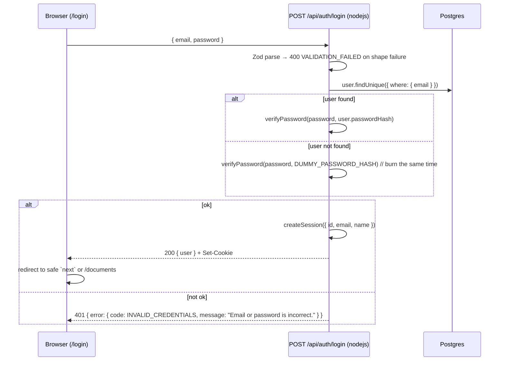

# 03 — Auth & Permissions

**Purpose.** This spec owns everything between "an HTTP request arrives" and "a route handler is
allowed to touch a `Document`": how a session is minted and read (`jose` HS256 JWT in an httpOnly
cookie), how passwords are hashed and verified (`bcryptjs`), what `middleware.ts` does and — more
importantly — what it deliberately does *not* do, and the single permission core (`lib/permissions.ts`)
that every document route must call. It restates the canonical capability matrix from
`00-foundation.md` §6 as the table the code mirrors line-for-line, pins the 403-vs-404 rule with its
threat model, and fixes the share invariants (no self-share, upsert-on-reshare, idempotent revoke,
owner-only share management). This is the surface reviewers probe hardest, so it is specified to the
level of real files, real signatures and real status codes. Data model: `00-foundation.md` §5.
Route bodies and the error envelope: `00-foundation.md` §7/§7a and `02-api-contract.md`.
Test wiring: `06-test-plan.md`.

---

## 1. Design summary

| Decision | Value | Why |
|---|---|---|
| Session transport | httpOnly cookie `shared_docs_session` | No token in JS, no XSS exfiltration path, no localStorage. |
| Session format | JWT, HS256, signed with `AUTH_SECRET` | Stateless — no session table, no DB read on every navigation. |
| Library | `jose` | Pure Web Crypto → **runs in Edge middleware**. `jsonwebtoken` depends on Node `crypto` and cannot. |
| Lifetime | 7 days, absolute (no refresh, no sliding window) | The demo is a one-sitting review. Refresh/rotation is named in §11 as the production gap. |
| Password hash | `bcryptjs`, cost 10 | Pure JS → no native build on Vercel. |
| Login runtime | `nodejs` (explicit `export const runtime`) | Prisma Client needs Node; bcrypt work is CPU-bound and unwelcome on Edge. |
| Authorization | One resolver + one pure capability function | `00-foundation.md` §6 rule 2: no route re-derives permissions inline. |
| Authorization layer | Route handlers, never middleware | See §5.3. |

**Why not Auth.js / NextAuth.** It would add a provider config, an adapter, and a JWT-vs-database-session
decision, for a product with three seeded accounts and one credential flow. The ~70 lines below are
faster to write, trivially testable, and — the actual deciding factor — explainable end-to-end in the
walkthrough video. Recorded in `ARCHITECTURE.md`.

### 1.1 Dependencies

Installed once by `T01` with everything else — **this slice runs no `pnpm add`** (`00-foundation.md` §2a).

| Package | Version line | Notes |
|---|---|---|
| `jose` | `6.2.10` | `SignJWT`, `jwtVerify`. Web Crypto only → works in Node **and** Edge. |
| `bcryptjs` | `3.0.3` | Pure JS. **v3 ships its own TypeScript types — do not install `@types/bcryptjs`** (it is a deprecated stub that will conflict). |
| `zod` | **`^4.1`**, pinned in `00-foundation.md` §2a | Schemas below are **Zod 4**: `z.email()` not `z.string().email()`, and `z.flattenError(err)` not `err.flatten()`. |

### 1.2 Files this spec owns

| Path | Contents |
|---|---|
| `lib/env.ts` | Fail-fast env validation (`AUTH_SECRET`, `DATABASE_URL`). |
| `lib/session-token.ts` | Sign/verify only, plus **`getSessionFromRequest(req)`**. **Edge-safe** — imported by `middleware.ts` *and* by `lib/api.ts`'s `withSession`. |
| `lib/session.ts` | `createSession` / `readSession` / `destroySession` / `requireSession`. Uses `next/headers`, so it is imported **only by Server Components and by the login/logout route bodies that write cookies** — never by a handler that needs to be callable from a test. |
| `lib/password.ts` | `hashPassword`, `verifyPassword`, `DUMMY_PASSWORD_HASH`. |
| `lib/permissions.ts` | `ROLES`, `AccessRole`, `CAPABILITIES`, `Capability`, `CAPABILITY_MATRIX`, `can`, `resolveAccess`, `requireAccess`. |
| `middleware.ts` | Cookie presence/validity gate for `/documents/*`. |
| `app/api/auth/login/route.ts` | Credential login. |
| `app/api/auth/logout/route.ts` | Cookie clear. |
| `app/api/auth/me/route.ts` | Current user echo. |
| `lib/permissions.test.ts` | Pure capability matrix suite — **colocated**, because the `unit` Vitest project's glob is `lib/**/*.test.ts` and a file under `tests/unit/` would silently never run (`00-foundation.md` §5a). |
| `tests/integration/auth.test.ts` | Login / 401 / 403 / 404 behaviour. |

**This slice does not own an error module.** There is one error class, `ApiError`, and one funnel,
`toResponse`, both in `lib/api.ts` (`02-api-contract.md` §4). `AppError`, `toErrorResponse` and
`lib/errors.ts` are gone — two error classes and two funnels in one repo reads as indecision, and
the code registry lives in `00-foundation.md` §7a either way.

> **Module rule:** only `lib/db.ts` (the one Prisma singleton, owned by `01-data-and-persistence.md`
> — there is no `lib/prisma.ts`) carries `import 'server-only'`. Putting it in `lib/session.ts`
> or `lib/permissions.ts` would make those modules throw when imported by Vitest (the `react-server`
> export condition is absent there), which would break the dependency-free unit suite required by
> `00-foundation.md` R3. `next/headers` already makes `lib/session.ts` un-importable from a Client
> Component, which is the protection we actually wanted.

---

## 2. `AUTH_SECRET` and fail-fast env

### 2.1 Generating it

```bash
# 48 random bytes, base64url — 64 chars, ~384 bits
node -e "console.log(require('node:crypto').randomBytes(48).toString('base64url'))"
# or
openssl rand -base64 48
```

### 2.2 Rules

- **Minimum 32 characters.** HS256 keys shorter than the 256-bit digest weaken the MAC; 32 chars is
  the floor we enforce, 64 is what we generate.
- **The app must refuse to boot without it.** Not "fall back to a dev default" — a hardcoded fallback
  is how a signing key ends up in production. `lib/env.ts` is imported by `lib/session-token.ts`, so
  a missing/short secret fails at module evaluation: `next dev` and `next build` both die loudly with
  an actionable message.
- Where it lives: local `.env` (git-ignored; `.env.example` ships with a placeholder and the generator
  command), and Vercel → Project → Settings → Environment Variables for Production **and** Preview.
- Rotating it invalidates every outstanding session. Acceptable: there is no rotation story in scope
  (see §11).

### 2.3 `lib/env.ts`

```ts
import { z } from 'zod'

const EnvSchema = z.object({
  AUTH_SECRET: z
    .string({ error: 'AUTH_SECRET is required' })   // Zod 4: `error`, not `required_error`
    .min(32, 'AUTH_SECRET must be at least 32 characters. Generate one with: node -e "console.log(require(\'node:crypto\').randomBytes(48).toString(\'base64url\'))"'),
  DATABASE_URL: z.string().min(1, 'DATABASE_URL is required'),
  NODE_ENV: z.enum(['development', 'test', 'production']).default('development'),
})

const parsed = EnvSchema.safeParse(process.env)

if (!parsed.success) {
  const issues = parsed.error.issues.map((i) => `  - ${i.path.join('.')}: ${i.message}`).join('\n')
  throw new Error(`Invalid environment configuration:\n${issues}\n\nSee .env.example.`)
}

export const env = parsed.data
export const isProduction = env.NODE_ENV === 'production'
```

> Shared with the persistence spec — `DATABASE_URL` / `DIRECT_URL` live here too. Whoever implements
> first creates the file; the other extends the schema. Do not create a second env module.
> The canonical variable list is `00-foundation.md` §2b, and there are exactly four:
> `DATABASE_URL`, `DIRECT_URL`, `AUTH_SECRET`, `TEST_DATABASE_URL`. **`SESSION_SECRET` does not
> exist** — an earlier draft of the README, the API spec and the test plan all named it, which would
> have made `lib/env.ts` throw at module evaluation on a clean clone.

---

## 3. Session

### 3.1 Cookie and payload

| Attribute | Value | Why |
|---|---|---|
| name | `shared_docs_session` | Namespaced; no collision with anything Vercel sets. |
| `httpOnly` | `true` | JS cannot read it → XSS cannot steal the session. |
| `sameSite` | `'lax'` | Blocks cross-site POST/PATCH/DELETE (our only state changes) while keeping top-level GET navigation into `/documents/:id` working from a shared link. |
| `secure` | `env.NODE_ENV === 'production'` | Required on Vercel (HTTPS); must be off on `http://localhost`. |
| `path` | `'/'` | The cookie must reach both `/documents/*` and `/api/*`. |
| `maxAge` | `604800` (7 days) | Matches the JWT `exp`; the cookie and the token expire together. |

Payload (exactly these claims, nothing else — the token is not a cache):

| Claim | Type | Source |
|---|---|---|
| `sub` | `string` | `User.id` (cuid) |
| `email` | `string` | `User.email` (already lowercased) |
| `name` | `string` | `User.name` |
| `iat` | `number` | set by `jose` |
| `exp` | `number` | `iat + 604800` |

`email`/`name` are denormalised into the token to render the header without a DB round-trip. They can
go stale — there is no profile editing in scope, so they cannot. **`sub` is the only claim any
authorization decision is allowed to read.**

### 3.2 `lib/session-token.ts` (Edge-safe, no `next/headers`)

```ts
import { SignJWT, jwtVerify } from 'jose'
import { env } from '@/lib/env'

export const SESSION_COOKIE = 'shared_docs_session'
export const SESSION_MAX_AGE_SECONDS = 60 * 60 * 24 * 7 // 7 days

export type SessionUser = {
  id: string
  email: string
  name: string
}

const secretKey = new TextEncoder().encode(env.AUTH_SECRET)

export async function signSessionToken(user: SessionUser): Promise<string> {
  return new SignJWT({ email: user.email, name: user.name })
    .setProtectedHeader({ alg: 'HS256', typ: 'JWT' })
    .setSubject(user.id)
    .setIssuedAt()
    .setExpirationTime(`${SESSION_MAX_AGE_SECONDS}s`)
    .sign(secretKey)
}

/**
 * THE primitive a route handler uses. Reads the cookie off the Request itself, so a
 * handler can be imported and called directly by the integration suite with no server
 * running. `cookies()` from next/headers throws outside a request scope, which is why
 * no handler may use it (00-foundation.md §7c, 06-test-plan.md §5.1).
 */
export async function getSessionFromRequest(req: Request): Promise<SessionUser | null> {
  const header = req.headers.get('cookie')
  if (!header) return null

  const token = header
    .split(';')
    .map((c) => c.trim())
    .find((c) => c.startsWith(`${SESSION_COOKIE}=`))
    ?.slice(SESSION_COOKIE.length + 1)

  return verifySessionToken(token)
}

/** Returns null for anything that is not a currently-valid, well-shaped token. Never throws. */
export async function verifySessionToken(token: string | undefined): Promise<SessionUser | null> {
  if (!token) return null

  try {
    const { payload } = await jwtVerify(token, secretKey, { algorithms: ['HS256'] })

    if (
      typeof payload.sub !== 'string' ||
      typeof payload.email !== 'string' ||
      typeof payload.name !== 'string'
    ) {
      return null
    }

    return { id: payload.sub, email: payload.email, name: payload.name }
  } catch {
    // expired, tampered, wrong alg, malformed — all indistinguishable to the caller by design
    return null
  }
}
```

Notes that matter:

- `algorithms: ['HS256']` is **not optional**. Without it a verifier can be talked into accepting
  `alg: none` or an asymmetric confusion attack. `jose` is safe by default, but pinning it is the
  habit, and a reviewer will look for it.
- Every failure mode collapses to `null`. Callers never branch on *why*.
- This module imports nothing from `next/headers`, `@prisma/client`, or Node builtins — that is what
  makes it importable from Edge middleware **and** from a Vitest process with no server running.
- **Cookie *reads* live here; cookie *writes* live in `lib/session.ts` or on a `NextResponse`.**
  That split is what lets `withSession` (`02-api-contract.md` §4) authenticate any handler while the
  login route still sets a cookie.

### 3.3 `lib/session.ts` (full)

```ts
import { cookies } from 'next/headers'
import { ApiError } from '@/lib/api'
import { isProduction } from '@/lib/env'
import {
  SESSION_COOKIE,
  SESSION_MAX_AGE_SECONDS,
  signSessionToken,
  verifySessionToken,
  type SessionUser,
} from '@/lib/session-token'

export { SESSION_COOKIE, type SessionUser }

/**
 * Mint a session and attach it to the response.
 * Route Handlers and Server Actions only — Next.js forbids cookie writes during a
 * Server Component render.
 */
export async function createSession(user: SessionUser): Promise<void> {
  const token = await signSessionToken(user)
  const store = await cookies()

  store.set({
    name: SESSION_COOKIE,
    value: token,
    httpOnly: true,
    sameSite: 'lax',
    secure: isProduction,
    path: '/',
    maxAge: SESSION_MAX_AGE_SECONDS,
  })
}

/** Current user, or null. Safe anywhere on the server. Does NOT hit the database. */
export async function readSession(): Promise<SessionUser | null> {
  const store = await cookies()
  return verifySessionToken(store.get(SESSION_COOKIE)?.value)
}

/**
 * Same as readSession, but throws instead of returning null. Server Components only —
 * a route handler gets its session from `withSession`, never from here.
 * NOTE: it THROWS. `const s = await requireSession(); if (!s) …` is a dead branch.
 */
export async function requireSession(): Promise<SessionUser> {
  const session = await readSession()
  if (!session) throw new ApiError('UNAUTHENTICATED', 'Sign in to continue.', 401)
  return session
}

/**
 * Clear the session. Overwriting with an empty, already-expired cookie (rather than only
 * calling delete) guarantees the browser drops it even if attributes differ.
 * Route Handlers and Server Actions only.
 */
export async function destroySession(): Promise<void> {
  const store = await cookies()

  store.set({
    name: SESSION_COOKIE,
    value: '',
    httpOnly: true,
    sameSite: 'lax',
    secure: isProduction,
    path: '/',
    maxAge: 0,
  })
}
```

> `cookies()` is **async in Next.js 15 and 16** — `await` it. This is the single most common porting
> bug from Next 14 examples.
>
> **Nothing under `app/api/**` imports this module for reads.** `06-test-plan.md` §5.1 requires
> handlers to be directly callable, and `cookies()` throws outside a request scope; the primitive is
> `getSessionFromRequest(req)` in §3.2, wrapped by `withSession`. The login and logout routes still
> import `createSession` / `destroySession` here, because writing a cookie is a request-scoped
> operation either way.

### 3.4 Errors — this spec does not define its own

There is **one** error class and **one** funnel, both in `lib/api.ts` (`02-api-contract.md` §4):

```ts
new ApiError(code, message, status, details?)   // note the argument order: code first
toResponse(err)                                 // the only path from a throw to a Response
```

and **one** code registry, `ApiErrorCode` in `00-foundation.md` §7a. The names this spec used to
invent are gone: `VALIDATION_ERROR` is **`VALIDATION_FAILED`**, and there is no `ErrorCode` union
here to drift from it. `SHARE_NOT_FOUND` (404, `PATCH` of a nonexistent share row) is in the
registry — §9.5 uses it rather than a generic `NOT_FOUND`, so a client can tell "document gone" from
"share gone".

This spec only *throws*. It does not serialise.

---

## 4. Passwords

### 4.1 `lib/password.ts`

```ts
import { compare, hash } from 'bcryptjs'

export const BCRYPT_COST = 10

export function hashPassword(plaintext: string): Promise<string> {
  return hash(plaintext, BCRYPT_COST)
}

export function verifyPassword(plaintext: string, passwordHash: string): Promise<boolean> {
  return compare(plaintext, passwordHash)
}

/**
 * A real cost-10 bcrypt hash of a value nobody knows. Compared against when the email
 * does not exist, so "unknown user" and "wrong password" burn the same CPU time and the
 * login endpoint is not a timing oracle for account existence.
 * Regenerate with:
 *   node -e "import('bcryptjs').then(b => b.hash(require('node:crypto').randomUUID(), 10)).then(console.log)"
 */
export const DUMMY_PASSWORD_HASH =
  '$2b$10$Nn5v0kQ1dR2yQ0YyqQ3sQeQ0k9dq0oQ8bJZ7nq4dWJ0yEo0f0Q3Ni' // replace with a freshly generated value
```

> The literal above is a placeholder shape. The implementer **must** paste a genuinely generated
> hash — an invalid bcrypt string makes `compare` reject instantly and reopens the timing channel.

### 4.2 Cost factor: why 10

| Cost | `bcryptjs` on a Vercel serverless CPU | Verdict |
|---|---|---|
| 8 | ~15 ms | Too cheap. |
| **10** | **~90–130 ms** | Chosen. bcrypt's own default; a noticeable but invisible login delay. |
| 12 | ~400–500 ms | Pure-JS bcrypt is roughly 3–4× slower than the native binding, so 12 here costs what 14 costs elsewhere. On a cold serverless invocation this makes the demo feel broken. |

Honest statement for `ARCHITECTURE.md`: with a long-lived Node server we would use `argon2id`, or
native `bcrypt` at cost 12. Cost 10 with pure JS is the right trade *for a Vercel-deployed demo with
three seeded accounts* — and the seed script uses the same `hashPassword`, so cost is defined once.

### 4.3 Why pure JS

`bcrypt` (the native one) needs `node-gyp`, a matching prebuilt binary for the Vercel build image, and
a `--platform` dance any time the runtime moves. `bcryptjs` is a dependency-free JS implementation with
byte-identical output — it drops into `pnpm install` and never appears in a build log again. Cheap
insurance against losing 30 minutes of an 8-hour budget to a native toolchain (`00-foundation.md` R5).

### 4.4 Node runtime

```ts
// app/api/auth/login/route.ts
export const runtime = 'nodejs'
```

Two reasons: Prisma Client needs Node, and 100 ms of synchronous-ish hashing is exactly what Edge CPU
limits punish. The same directive appears on every route that touches Prisma; the API spec restates it.

---

## 5. Authentication flow

### 5.1 Login, end to end



`app/api/auth/login/route.ts`:

The route uses the shared plumbing from `02-api-contract.md` §4 — `withPublic`, `parseJson`, `ok`,
`ApiError` — like every other route in the app. It does **not** hand-roll a `try`/`catch`:
`02`'s definition of done greps for a wrapper on every handler, and three plumbing conventions in one
codebase is the thing a reviewer notices before any feature.

```ts
import { prisma } from '@/lib/db'
import { createSession } from '@/lib/session'
import { DUMMY_PASSWORD_HASH, verifyPassword } from '@/lib/password'
import { ApiError, ok, parseJson, withPublic } from '@/lib/api'
import { loginSchema } from '@/lib/schemas'     // 02-api-contract.md §7.1 — one schema,
                                                // imported by the client too (04 §4.2)

export const runtime = 'nodejs'

export const POST = withPublic(async (request) => {
  const { email, password } = await parseJson(request, loginSchema)

  const user = await prisma.user.findUnique({ where: { email } })

  // Always run exactly one bcrypt comparison, found or not.
  const valid = await verifyPassword(password, user?.passwordHash ?? DUMMY_PASSWORD_HASH)

  if (!user || !valid) {
    throw new ApiError('INVALID_CREDENTIALS', 'Email or password is incorrect.', 401)
  }

  await createSession({ id: user.id, email: user.email, name: user.name })
  return ok({ user: { id: user.id, email: user.email, name: user.name } })
})
```

**The anti-enumeration choice, stated plainly.** A wrong email and a wrong password return the
*identical* response: `401`, code `INVALID_CREDENTIALS`, message **`"Email or password is incorrect."`**
(the exact string `02-api-contract.md` §7.1 puts on the wire and `04-ui-spec.md` §4.3 renders), and —
because of `DUMMY_PASSWORD_HASH` — approximately the same latency. There is no `USER_NOT_FOUND` on
this endpoint. A login form that distinguishes the two cases is a free account-existence oracle, and
it is the single most common access-control miss in a take-home. The friendlier "no account with that
email" copy is a UX win we deliberately decline; `ARCHITECTURE.md` says so.

> **Known inconsistency, owned not hidden.** `GET /api/users?q=` (`00-foundation.md` §7) exposes the
> three-account demo directory, so this build *does* leak the user list by another door — foundation
> already flags it as a deliberate simplification. Login is still not the leak, and both the
> production fix (invite by exact email, never a prefix search) and the tightening proposed in §12 are
> written down.

Password is **never** logged, never echoed, never included in any error `details`. `parsed.error.flatten()`
returns field paths and messages only, never values.

**Demo buttons are not a backdoor.** The one-click account buttons on `/login` (`00-foundation.md` §8)
POST this same endpoint with the published demo password `demo1234`. There is no bypass route, no
`?demo=1`, no seeded pre-signed cookie. That is worth one sentence in the video.

**Post-login redirect.** The client sends the user to `next` only if it passes
`next.startsWith('/documents')` — a relative, allow-listed prefix. Anything else falls back to
`/documents`. This closes the open-redirect that a naive `?next=` implementation ships with.

### 5.2 Logout and me

| Route | Runtime | Behaviour |
|---|---|---|
| `POST /api/auth/logout` | edge-safe, but keep `nodejs` for uniformity | `await destroySession()` → `200 { ok: true }`. Idempotent: works with no cookie, with an expired one, with a forged one. Never 401s. |
| `GET /api/auth/me` | `nodejs` | `await requireSession()` → `200 { user }`. No cookie → `401 UNAUTHENTICATED`. Reads the token only; no DB query. |

`POST` (not `GET`) for logout: a `GET` that mutates state is CSRF-able through an `` tag, and
`sameSite=lax` does not protect top-level GETs.

### 5.3 `middleware.ts`

```ts
import { NextResponse, type NextRequest } from 'next/server'
import { SESSION_COOKIE, verifySessionToken } from '@/lib/session-token'

export async function middleware(request: NextRequest) {
  const token = request.cookies.get(SESSION_COOKIE)?.value
  const session = await verifySessionToken(token)

  if (session) return NextResponse.next()

  const loginUrl = new URL('/login', request.url)
  loginUrl.searchParams.set('next', request.nextUrl.pathname)

  const response = NextResponse.redirect(loginUrl)
  if (token) response.cookies.delete(SESSION_COOKIE) // expired/garbage — stop re-sending it
  return response
}

export const config = {
  matcher: ['/documents/:path*'],
}
```

**What it does:** for page navigations under `/documents/*`, verifies the cookie's signature and
expiry and redirects to `/login?next=…` when there isn't a valid one. That is the entire contract. It
exists so an unauthenticated visitor sees a login screen instead of a flash of empty dashboard.

**What it does NOT do — and must never be extended to do:**

| Not done | Why |
|---|---|
| Any database query | Prisma Client does not run on the Edge runtime without a separate HTTP driver, and a DB round-trip on every navigation is a latency tax for zero authorization value. |
| Any document-level authorization | The permission check needs `Document.ownerId` and `DocumentShare` rows — i.e. the database. See above. |
| Guard `/api/*` | The matcher deliberately excludes it. Every API route authenticates itself via `requireSession()`. |
| Role checks | `AccessRole` is a property of a (user, document) pair, not of a URL. |

**Why middleware is the wrong layer for per-resource checks:**

1. **It is path-shaped; authorization is data-shaped.** A matcher can tell you the URL contains a
   document id. It cannot tell you whether *this* user has a share row for it. Deriving that requires
   the exact query the route handler is about to run anyway — doing it twice is two chances to drift.
2. **It is not on every path to the data.** Middleware runs for matched requests. Route Handlers,
   Server Actions and RSC data fetches can be reached in ways a given matcher does not cover, and one
   forgotten pattern is a silent, total authorization bypass. Checks that live *next to the data
   access* cannot be routed around.
3. **The framework itself has been the bypass.** Next.js shipped **CVE-2025-29927**, where a crafted
   `x-middleware-subrequest` header caused middleware to be skipped entirely. Every app that treated
   middleware as its authorization boundary was fully exposed by a one-line request change. We run
   **Next 16.3.4** (`00-foundation.md` §2a), which is long past the patch, *and* keep middleware out
   of the security boundary — defence in depth means the CVE would have cost us a redirect, not our
   data.
4. **Fail-open vs fail-closed.** A middleware that throws mid-request has ambiguous behaviour. A route
   handler that throws returns a 500 and touches nothing.

The one-line summary for the video: *"middleware is a redirect for humans; `resolveAccess` is the
security boundary."*

---

## 6. The permission core — `lib/permissions.ts` (full)

```ts
import { prisma } from '@/lib/db'
import { ApiError } from '@/lib/api'
import type { Document, ShareRole } from '@prisma/client'

/**
 * ROLES includes NONE, and the matrix has an explicit all-false NONE row, so `can()` is
 * TOTAL over four roles. An earlier draft modelled "no access" as the absence of a
 * resolution (`resolveAccess` -> null) on the grounds that unrepresentable beats
 * defensively handled. That was reversed, for one concrete reason: the highest-value test
 * in the repo is a 24-cell table over 4 roles x 6 capabilities, and `can('NONE', c)` has
 * to be a callable expression for it to exist. A `TypeError: Cannot read properties of
 * undefined` in the permission suite is a worse outcome than a row of six `false`s.
 * See 00-foundation.md §6a.
 */
export const ROLES = ['OWNER', 'EDITOR', 'VIEWER', 'NONE'] as const
export type AccessRole = (typeof ROLES)[number]

export const CAPABILITIES = [
  'read',
  'update',
  'rename',
  'delete',
  'viewShares',
  'manageShares',
] as const
export type Capability = (typeof CAPABILITIES)[number]

/** The role of the *caller* once access is known to exist. */
export type MyRole = Exclude<AccessRole, 'NONE'>

/**
 * The single source of truth for authorization, mirroring 00-foundation.md §6 row for row.
 * Adding a Capability to the union without adding it to all four rows is a type error.
 */
export const CAPABILITY_MATRIX: Record<AccessRole, Record<Capability, boolean>> = {
  OWNER:  { read: true,  update: true,  rename: true,  delete: true,  viewShares: true,  manageShares: true  },
  EDITOR: { read: true,  update: true,  rename: true,  delete: false, viewShares: false, manageShares: false },
  VIEWER: { read: true,  update: false, rename: false, delete: false, viewShares: false, manageShares: false },
  NONE:   { read: false, update: false, rename: false, delete: false, viewShares: false, manageShares: false },
} as const

/**
 * Pure: no I/O, no database, no request context, no clock. Given the same (role, capability)
 * it always returns the same boolean, which is precisely what makes the whole authorization
 * policy exhaustively unit-testable in milliseconds with no Postgres running
 * (24 assertions, lib/permissions.test.ts). Every stateful part of authorization is
 * pushed into resolveAccess; every *decision* lives here.
 */
export function can(role: AccessRole, capability: Capability): boolean {
  return CAPABILITY_MATRIX[role][capability]
}

/**
 * `document` is non-null if and only if `role !== 'NONE'`. Carrying the row out of the
 * resolver is what lets `GET /api/documents/:id` answer from ONE query.
 */
export type ResolvedAccess =
  | { role: MyRole; document: Document }
  | { role: 'NONE'; document: null }

function shareRoleToAccessRole(role: ShareRole): MyRole {
  return role === 'EDITOR' ? 'EDITOR' : 'VIEWER'
}

/**
 * The ONE query that answers "can this user see this document, and as what?".
 * A single round-trip: the OR covers ownership and share membership, and the filtered
 * `include` brings back only this user's share row (0 or 1, guaranteed by
 * @@unique([documentId, userId])).
 *
 * Returns role 'NONE' for BOTH "the document does not exist" and "the user has no access",
 * which is what makes the 404 response in §8 indistinguishable between the two cases.
 */
export async function resolveAccess(
  userId: string,
  documentId: string,
): Promise<ResolvedAccess> {
  const row = await prisma.document.findFirst({
    where: {
      id: documentId,
      OR: [
        { ownerId: userId },
        { shares: { some: { userId } } },
      ],
    },
    include: {
      shares: {
        where: { userId },
        select: { role: true },
      },
    },
  })

  if (!row) return { role: 'NONE', document: null }

  const { shares, ...document } = row

  // Ownership always wins, even if a stray share row also exists.
  if (document.ownerId === userId) return { document, role: 'OWNER' }

  const shareRole = shares[0]?.role
  if (!shareRole) return { role: 'NONE', document: null } // unreachable; fail closed anyway

  return { document, role: shareRoleToAccessRole(shareRole) }
}

/**
 * The only helper a route handler should call. Encodes the 401 -> 404 -> 403 ordering from §8.
 * Throws ApiError; `withSession`'s funnel converts it to the standard error envelope.
 * Named `requireAccess` (not `requireAccess`) because that is the name every call site
 * in 02-api-contract.md already uses.
 */
export async function requireAccess(
  userId: string,
  documentId: string,
  capability: Capability,
): Promise<{ role: MyRole; document: Document }> {
  const access = await resolveAccess(userId, documentId)

  if (access.role === 'NONE') {
    throw new ApiError('NOT_FOUND', 'Document not found.', 404)
  }

  if (!can(access.role, capability)) {
    throw new ApiError(
      'FORBIDDEN',
      `Your access level (${access.role}) does not allow you to ${capability} this document.`,
      403,
    )
  }

  return access
}
```

Usage is uniform — every document route is three lines of preamble and then business logic:

```ts
// app/api/documents/[id]/route.ts — DELETE
export const DELETE = withSession(async (_request, { params, session }) => {
  const { id } = await params
  await requireAccess(session.id, id, 'delete')

  await prisma.document.delete({ where: { id } })
  // 200 with a body, not 204: `02-api-contract.md` I1 says every response has a JSON body,
  // because `apiFetch` calls `res.json()` unconditionally. A 204 here throws
  // "SyntaxError: Unexpected end of JSON input" in the client on every successful delete.
  return ok({ ok: true, id })
})
```

Route → capability mapping — canonical in `00-foundation.md` §6a, restated here because this is
where the code lives:

| Route | Capability |
|---|---|
| `GET /api/documents/:id` | `read` |
| `PATCH /api/documents/:id` (content) | `update` |
| `PATCH /api/documents/:id` (title) | `rename` |
| `DELETE /api/documents/:id` | `delete` |
| `GET /api/documents/:id/shares` | `viewShares` |
| `POST` / `PATCH` / `DELETE` `/api/documents/:id/shares…` | `manageShares` |

> A `PATCH` body carrying both `title` and `content` must satisfy **both** `rename` and `update`.
> With the current matrix they are held by the same roles, but check both anyway — the matrix is the
> thing allowed to change, not the call sites.

`documentId` is passed through unvalidated beyond `z.string().min(1)`. A malformed cuid simply matches
nothing and falls out as a `404`, which is the response we wanted anyway; a cuid-shaped regex would
add a distinct failure mode for zero benefit.

---

## 7. Capability matrix (source table)

Restated verbatim from `00-foundation.md` §6. `CAPABILITY_MATRIX` above mirrors this; if they ever
disagree, foundation wins and the code is the bug.

| Capability | Code key | OWNER | EDITOR | VIEWER | NONE |
|---|---|:--:|:--:|:--:|:--:|
| read document | `read` | ✅ | ✅ | ✅ | ❌ |
| update content | `update` | ✅ | ✅ | ❌ | ❌ |
| rename | `rename` | ✅ | ✅ | ❌ | ❌ |
| delete | `delete` | ✅ | ❌ | ❌ | ❌ |
| view share list | `viewShares` | ✅ | ❌ | ❌ | ❌ |
| grant / change / revoke share | `manageShares` | ✅ | ❌ | ❌ | ❌ |

`NONE` **is** a member of `ROLES` and the matrix has an explicit all-`false` `NONE` row, so the
`NONE` column is enforced by data rather than by a type-level absence. That is what makes the 24-cell
unit suite in `06-test-plan.md` §3 expressible. See the doc comment on `ROLES` for why this reversed.

---

## 8. 403 vs 404

### 8.1 The rule

> **A user with no access to a document gets `404`, identical in status, code, message and body to
> the response for a document id that has never existed. `403` is reserved for "you can see this
> document, but you may not do *that* to it".**

### 8.2 Threat model: existence leakage

If a non-collaborator got `403`, the API would confirm that a given document id exists. Document ids
are cuids, so an attacker cannot brute-force the id space — but ids leak constantly through ordinary
life: a URL pasted in Slack, a screenshot, a browser-history sync, a stale bookmark, an OG preview, a
support ticket. `403`-on-no-access turns every one of those leaked strings into a working
**confirmation oracle**: *this document exists, and it is not mine.* Combined with `GET /api/users`,
that is enough to map who-has-what without ever reading a document.

`404` costs nothing — the caller cannot act on either answer — and removes the oracle entirely.
Carol hitting Alice's private third document (the seeded negative path, `00-foundation.md` §5) sees
exactly what she would see for `/documents/definitely-not-real`.

The information we *do* concede: a `403` tells you that a document exists — but only to someone who
already has read access and therefore already knew. And the `403` message naming the caller's own
role (`VIEWER`) is information they already hold. No leak.

### 8.3 Mechanical decision tree

```
request arrives
│
├─ valid session cookie?
│    └─ NO ──────────────────────────────────► 401 UNAUTHENTICATED
│                                                "Sign in to continue."
└─ YES
     │
     ├─ resolveAccess(session.id, documentId) === null ?
     │    └─ YES ─────────────────────────────► 404 NOT_FOUND
     │            (covers BOTH "no such document"    "Document not found."
     │             and "exists, not shared with you")
     └─ NO  → role is OWNER | EDITOR | VIEWER
          │
          ├─ can(role, capability) === false ─► 403 FORBIDDEN
          │                                      "Your access level (ROLE) does not allow…"
          └─ true ───────────────────────────► proceed
```

The order is non-negotiable: **authenticate → resolve visibility → check capability.** Checking
capability before visibility would 403 a stranger and leak existence.

### 8.4 Worked cases (these are the integration-test rows)

| Actor | Request | `resolveAccess` | Capability | Response |
|---|---|---|---|---|
| no cookie | `GET /api/documents/d1` | — | — | `401 UNAUTHENTICATED` |
| expired cookie | `GET /api/documents/d1` | — | — | `401 UNAUTHENTICATED` |
| Carol (no access to `d3`) | `GET /api/documents/d3` | `null` | — | `404 NOT_FOUND` |
| anyone | `GET /api/documents/nope-not-real` | `null` | — | `404 NOT_FOUND` — **byte-identical to the row above** |
| Carol (VIEWER on `d2`) | `GET /api/documents/d2` | `VIEWER` | `read` ✅ | `200` |
| Carol (VIEWER on `d2`) | `PATCH /api/documents/d2` | `VIEWER` | `update` ❌ | `403 FORBIDDEN` |
| Bob (EDITOR on `d1`) | `PATCH /api/documents/d1` | `EDITOR` | `update` ✅ | `200` |
| Bob (EDITOR on `d1`) | `DELETE /api/documents/d1` | `EDITOR` | `delete` ❌ | `403 FORBIDDEN` |
| Bob (EDITOR on `d1`) | `GET /api/documents/d1/shares` | `EDITOR` | `viewShares` ❌ | `403 FORBIDDEN` |
| Bob (EDITOR on `d1`) | `POST /api/documents/d1/shares` | `EDITOR` | `manageShares` ❌ | `403 FORBIDDEN` |
| Alice (OWNER of `d1`) | any of the above | `OWNER` | ✅ | `200` (never `204` — every response has a body) |

---

## 9. Share invariants

All share routes require `manageShares` (or `viewShares` for the list), so `requireAccess` has
already reduced the caller to the owner before any of this runs.

### 9.1 Only the OWNER manages shares — an EDITOR cannot re-share

`manageShares: false` for `EDITOR`, in one place, enforced on `POST`, `PATCH` and `DELETE` of
`/api/documents/:id/shares…`. **This is the invariant most commonly missed** — the intuitive mental
model is "an editor can do everything except delete", and re-sharing slips through. It is refused
deliberately: the moment an editor can grant access, the owner can no longer answer "who can see this
document?" without walking a delegation graph, and revoking their own grant no longer revokes access.
Transitive delegation is a product decision, not a side effect of the word "editor".

Same reasoning: `role` on a share is `VIEWER | EDITOR` only. **`OWNER` cannot be granted.** Ownership
transfer is out of scope (`00-foundation.md` §4).

### 9.2 Cannot share with yourself

```ts
if (target.id === session.id) {
  throw new ApiError('CANNOT_SHARE_WITH_SELF', 'You already own this document.', 400)
}
```

`400`, not `403`: the caller is the owner and is fully authorised — the *request* is nonsensical. The
check is on user id, not email string, so casing or whitespace cannot sneak past it. Without it a
`DocumentShare` row would exist where `userId === document.ownerId`, and `resolveAccess`'s
owner-wins branch would quietly ignore it — a row that means nothing, forever, in the share list UI.

### 9.3 Re-sharing an existing recipient UPDATES the role (upsert)

`@@unique([documentId, userId])` (`00-foundation.md` §5) makes this a database-level guarantee, and
Prisma exposes the compound key as `documentId_userId`:

```ts
const existing = await prisma.documentShare.findUnique({
  where: { documentId_userId: { documentId, userId: target.id } },
  select: { id: true },
})

const row = await prisma.documentShare.upsert({
  where: { documentId_userId: { documentId, userId: target.id } },
  create: { documentId, userId: target.id, role, grantedById: session.id },
  update: { role },
  include: { user: { select: { id: true, name: true, email: true } } },
})

// MAP, do not spread: the wire type is `ShareEntry` from 02-api-contract.md §3 —
// { userId, user, role, grantedAt }. Returning the raw Prisma row would leak `id`,
// `documentId`, `grantedById` and `createdAt` into an unspecified response shape.
// `created` is what lets the UI say "Shared with Bob" vs "Bob is now an editor"
// (04-ui-spec.md §8.5) — without it that copy is unimplementable.
return ok({
  share: {
    userId: row.userId,
    user: row.user,
    role: row.role,
    grantedAt: row.createdAt.toISOString(),
  },
  created: existing === null,
})
```

Sharing with Bob as `VIEWER` and then again as `EDITOR` leaves **one** row, role `EDITOR`. No
duplicate, no `P2002` surfaced to the user, no "already shared" error the UI would have to explain.
`grantedById` is preserved on update — it records who first opened the door.

`201` on first grant vs `200` on update is a distinction we do not make: the share endpoint always
returns `200` with the resulting share. Idempotent, and the client just re-renders the list.

### 9.4 Revoking is idempotent

```ts
await prisma.documentShare.deleteMany({ where: { documentId, userId } })
return ok({ ok: true, userId })      // 200 with a body, never 204 — see §6
```

`deleteMany`, not `delete`: `delete` throws Prisma `P2025` when the row is gone, which would make a
double-click on "Remove" produce an error toast for an outcome the user already has. `DELETE
/api/documents/:id/shares/:userId` returns `200 {ok:true, userId}` whether it removed one row or
zero, and `02-api-contract.md` §7.11 was changed from its earlier non-idempotent `404` to match. Revocation is
immediate — `resolveAccess` reads live rows, and there is no cached authorization anywhere. A viewer
whose access is revoked mid-session gets `404` on their next autosave or reload.

### 9.5 Changing a role on a share that does not exist

```ts
const { count } = await prisma.documentShare.updateMany({
  where: { documentId, userId },
  data: { role },
})
if (count === 0) throw new ApiError('SHARE_NOT_FOUND', 'Share not found.', 404)
```

A `404` here is safe: the caller is the owner and already knows the document exists. It is a statement
about the *share*, not the document — which is exactly why the code is **`SHARE_NOT_FOUND`** and not
the generic `NOT_FOUND`: the client has to be able to tell "the document is gone" from "that share is
gone", and it branches on `code`, never on `message` (`02-api-contract.md` I12).

### 9.6 Sharing with an email that has no account

`404 USER_NOT_FOUND` — "No user with that email." This is the one place the API confirms account
existence, and it is a conscious trade in a three-seeded-account demo where the share picker
(`GET /api/users?q=`) already lists everyone. The production answer is a pending-invite row keyed by
email plus a generic "invitation sent", which leaks nothing. Written into `ARCHITECTURE.md`; see also
§12.

### 9.7 Cascades

`onDelete: Cascade` on both `DocumentShare` relations (`00-foundation.md` §5) means deleting a
document or a user removes its share rows. No orphan can grant access; no cleanup code needed.

---

## 10. Client-side enforcement is UX, not security

| Client affordance | Where | What it actually is |
|---|---|---|
| TipTap `editable: false` | `/documents/[id]` when `myRole === 'VIEWER'` | A read-only *appearance*. Flipping it in devtools takes five seconds. |
| Read-only banner | editor header | Explains why the toolbar is inert. |
| Share button hidden | editor header, `myRole !== 'OWNER'` | Hides a button whose endpoint still exists. |
| Delete hidden | dashboard card / editor menu, `myRole !== 'OWNER'` | Same. |
| Autosave disabled | editor | Prevents a pointless doomed `PATCH`. |

**The server `403` is the control.** Every one of the affordances above is decoration over a route
that independently calls `requireAccess`. A viewer who removes `readOnly` in the console types
happily into the DOM and gets `403 FORBIDDEN` on the first autosave, with the conflict/error surface
described in `04-ui-spec.md` §6.6.

`myRole` is not computed on the client. `GET /api/documents/:id` returns it from the *same*
`resolveAccess` call that authorised the read, so the UI and the enforcement point cannot drift —
there is exactly one implementation of "what may this person do".

**Both layers are tested** (`00-foundation.md` §6 rule 3):

- `lib/permissions.test.ts` — table-driven over the 4 × 6 matrix (**24 assertions**, including the
  all-`false` `NONE` row), plus a guard that every `Role` × `Capability` pair is covered. No DB, no
  network. Runs under `pnpm test:unit` with `vi.mock('@/lib/db', () => ({ prisma: {} }))` at the top
  of the file so the pure suite stays dependency-free per `00-foundation.md` R3. **Colocated**, not
  under `tests/unit/` — the unit project's glob is `lib/**/*.test.ts`. Full listing:
  `06-test-plan.md` §3.3.
- `tests/integration/auth.test.ts` — against Docker Postgres: login sets a verifiable cookie; wrong
  email and wrong password produce **identical response bodies**; `GET /api/auth/me` 401s without a
  cookie; a VIEWER's `PATCH` returns `403`; a non-collaborator's `GET` and a nonexistent id's `GET`
  return byte-identical `404`s; an EDITOR's `POST …/shares` returns `403`; a double revoke returns
  `200` twice; re-sharing updates rather than duplicating.

Details of the harness live in `06-test-plan.md` §5; the assertions above are this spec's contract.

---

## 11. What a production system would add

Deliberately out of scope for 8 hours. Say these out loud in the video — naming the gap is the
seniority signal, and each line below is one sentence of `ARCHITECTURE.md`.

| Gap | What production does |
|---|---|
| **Refresh tokens / rotation** | 15-minute access token + rotating refresh token with reuse detection, instead of one 7-day bearer cookie. Today, a stolen cookie is valid for a week. |
| **Login rate limiting** | Per-IP *and* per-email sliding window (e.g. `@upstash/ratelimit` on Vercel KV), with lockout and backoff. Right now bcrypt cost 10 is the only thing slowing an attacker down. |
| **CSRF defence in depth** | `sameSite=lax` blocks cross-site mutations, which covers our whole mutation surface — but it is a single control. Production adds an `Origin`/`Sec-Fetch-Site` check and a double-submit token, so a browser bug or a same-site subdomain takeover is not game over. |
| **Audit log** | Append-only `AccessEvent` rows for every grant, role change, revoke and delete: who, what, when, from where. Sharing without an audit trail is unanswerable in an incident. |
| **Org / team scoping** | A `Workspace` + `Membership` layer so access is granted to groups, not one row per person per document. Per-document ACLs do not survive contact with a 200-person company. |
| **Revocation on password change** | A `sessionsValidFrom` timestamp per user, compared against the token's `iat`. Note the honest cost: this reintroduces a DB read per authenticated request, which is exactly what the stateless JWT was buying us — production pays it (or caches it in Redis), a demo should not. |
| **Stronger hashing + rotation** | `argon2id` with tuned memory cost, plus rehash-on-login when parameters change. |
| **Secret rotation** | A `kid` header and a key set, so `AUTH_SECRET` can be rotated without logging everyone out. |
| **No enumeration anywhere** | Kill `GET /api/users?q=`; invite by exact email with a pending-invite row and a uniform "invitation sent" response. |

---

## 12. Rulings (previously "open questions")

1. ❌ **REJECTED — `AccessRole` has four members, including `NONE`.** This spec proposed modelling
   "no access" as the absence of a resolution and rewording §6 to "three roles plus the absence of
   access". Overruled: two of the three consumers need the fourth member. `06-test-plan.md` §3's
   24-cell matrix calls `can('NONE', c)` directly, and `02-api-contract.md`'s guard branches on
   `role === 'NONE'`; under the three-member design the first is a `TypeError` and the second never
   matches. `00-foundation.md` §6a now pins the four-member union with an explicit all-`false` `NONE`
   row, and §6 keeps the word "Four". §6 of this spec was rewritten to match.
2. ❌ **REJECTED — `GET /api/users?q=` keeps its current behaviour** (2-character minimum, substring
   match, `take: 10`, self excluded). The proposed tightening (`q.length >= 3`, prefix-only, `take: 5`)
   would silently return nothing for the share picker, which queries at two characters
   (`04-ui-spec.md` §8.2) — and it would not remove the enumeration surface, only make it look
   smaller on a three-account directory. The honest treatment is what was already planned: name the
   trade in `ARCHITECTURE.md` with the real fix (invite by exact email, no listing) beside it.
   Recorded in `02-api-contract.md` under "Rulings", item 3.
3. ✅ **`lib/env.ts` is adopted** and is the only env module. The canonical variable list is
   `00-foundation.md` §2b — four variables, and the session key is `AUTH_SECRET`.
4. ✅ **Middleware covers `/documents/:path*` only.** Every API route authenticates itself through
   `withSession`. No other spec may assume the API is guarded by middleware.
5. ✅ **Sharing with an unregistered email returns `404 USER_NOT_FOUND`.** In the registry
   (`00-foundation.md` §7a) and named in `ARCHITECTURE.md` as the second acknowledged enumeration
   surface.
6. ❌ **Not shipping the `Origin` header check.** ~10 lines, but it is scope the foundation did not
   authorise and `sameSite=lax` covers the whole mutation surface here. Listed in §11 as the
   production gap instead.

### 12.1 What this spec had to give up

Recorded because "the API spec won" is a decision, not an accident:

| This spec proposed | What ships | Why |
|---|---|---|
| `AppError(status, code, message)` + `toErrorResponse` in `lib/errors.ts` | `ApiError(code, message, status)` + `toResponse` in `lib/api.ts` | One error class, one funnel. Two of each is the "indecision" a reviewer reads off a repo before reading a feature. |
| `VALIDATION_ERROR` | `VALIDATION_FAILED` | `02-api-contract.md` owns the wire registry (`00-foundation.md` §7a). |
| `204` on both deletes | `200` with a JSON body | `apiFetch` calls `res.json()` unconditionally; a `204` is a `SyntaxError` in the client. |
| bare `try`/`catch` per route | `withSession` / `withPublic` | `02`'s DoD greps for a wrapper on every handler. |
| `requireCapability` | `requireAccess` | Same function, the name every call site already used. |
| `cookies()` inside handlers | `getSessionFromRequest(req)` | `cookies()` throws outside a request scope, which would delete the entire integration suite. |

---

## Definition of done

- [ ] `pnpm dev` and `pnpm build` both fail with a readable, actionable error when `AUTH_SECRET` is
      missing or shorter than 32 characters; `.env.example` documents the generator command.
- [ ] `lib/session-token.ts` imports nothing from `next/headers`, `@prisma/client` or Node builtins,
      and `middleware.ts` runs on the Edge runtime without a bundler warning.
- [ ] `jwtVerify` is called with `algorithms: ['HS256']`.
- [ ] A successful login sets `shared_docs_session` with `HttpOnly`, `SameSite=Lax`, `Path=/`,
      `Max-Age=604800`, and `Secure` present in production and absent on `http://localhost`
      (verified in the browser's cookie inspector).
- [ ] `POST /api/auth/login` with an unknown email and with a known email + wrong password return
      **identical** status (`401`), code (`INVALID_CREDENTIALS`), and message; asserted in
      `tests/integration/auth.test.ts`.
- [ ] `DUMMY_PASSWORD_HASH` is a real generated cost-10 bcrypt string, not the placeholder in §4.1.
- [ ] `app/api/auth/login/route.ts` declares `export const runtime = 'nodejs'`.
- [ ] The password plaintext appears in no log line, no response body, and no error `details`.
- [ ] The `/login` demo buttons POST `/api/auth/login`; no alternative login path exists in the codebase.
- [ ] The post-login redirect accepts only targets starting with `/documents`.
- [ ] Visiting `/documents` logged out redirects to `/login?next=/documents`; the matcher is exactly
      `['/documents/:path*']` and middleware performs no database access.
- [ ] `lib/permissions.ts` exports `ROLES` (**including `NONE`**), `AccessRole`, `CAPABILITIES`,
      `Capability`, `CAPABILITY_MATRIX`, `can`, `resolveAccess`, `requireAccess`, and
      `CAPABILITY_MATRIX` matches §7 cell for cell across **all four** rows.
- [ ] `resolveAccess` performs exactly **one** Prisma query and returns `{ role: 'NONE', document: null }`
      for both "no such document" and "no access".
- [ ] `can()` has no imports in its call path that touch I/O; `lib/permissions.test.ts` passes
      with no database and no network (**24** matrix assertions + the exhaustiveness guard), and it
      is collected by the `unit` project's `lib/**/*.test.ts` glob.
- [ ] Every route under `/api/documents` is wrapped by `withSession` and calls `requireAccess()`; a
      repo-wide grep finds no inline `ownerId === session.id` comparison outside `lib/permissions.ts`,
      and `grep -rn "next/headers" app/api/` is empty.
- [ ] No file defines `AppError`, `toErrorResponse` or `lib/errors.ts`; `grep -rn "VALIDATION_ERROR" .`
      returns nothing.
- [ ] Integration tests prove: non-collaborator `GET` and nonexistent-id `GET` return byte-identical
      `404` bodies; VIEWER `PATCH` → `403`; EDITOR `DELETE` → `403`; EDITOR `GET .../shares` → `403`;
      EDITOR `POST .../shares` → `403`.
- [ ] Sharing with yourself → `400 CANNOT_SHARE_WITH_SELF`; re-sharing an existing recipient leaves
      one row with the new role and returns `{ share, created: false }`; `DELETE` of a share returns
      `200` on the second call too; `PATCH` of a nonexistent share returns `404 SHARE_NOT_FOUND`.
- [ ] A `role` of `OWNER` is rejected by the share-body Zod schema.
- [ ] A VIEWER who forces the TipTap editor editable in devtools receives `403` on autosave, and the
      UI surfaces it (manually verified once, and recorded in the walkthrough video).
- [ ] §11 and the two acknowledged enumeration surfaces (`GET /api/users`, share-by-unknown-email) are
      written into `ARCHITECTURE.md`.
