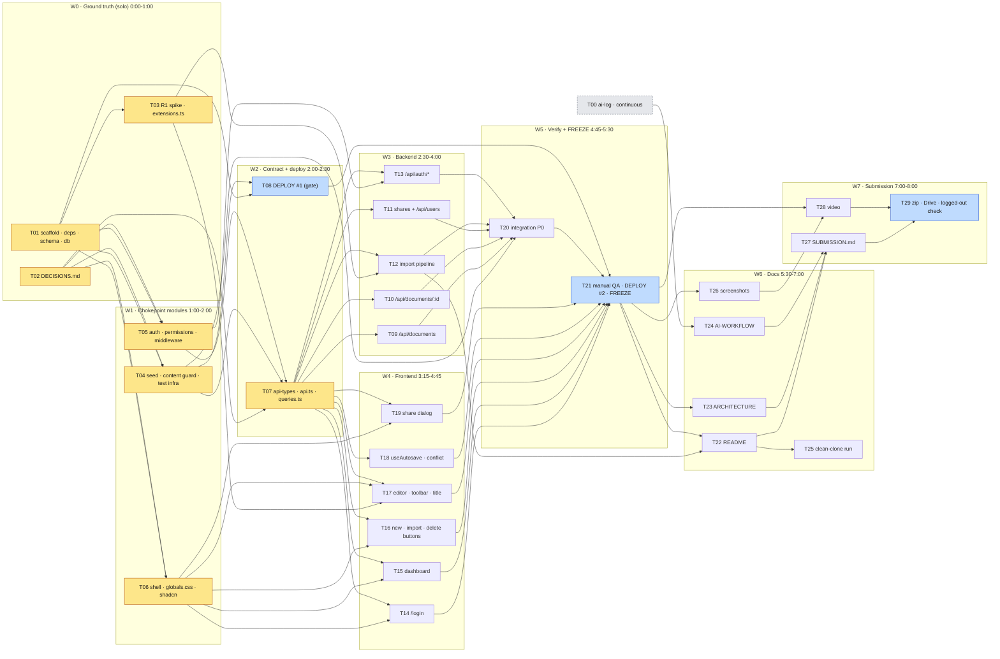

# 10 — Execution Plan / Task Graph

> ⚠️ **Superseded in places by `specs/DECISIONS.md`.** D005–D012 were ruled after this
> file was written and OUTRANK it. In particular: Prisma is **6.19.3** (not 7.x) so
> `prisma.config.ts` must NOT exist and `package.json#prisma.seed` is correct (D006);
> risk **R1 is CLOSED on Plan A** so `.docx` ships and no jsdom is needed (D007); Zod is
> **^4.1** (D011). Read `DECISIONS.md` before acting on anything below.

**Purpose.** This is the file the build is driven from. Everything upstream of it describes
*what* shared-docs is; this file decides *in what order it gets made, by whom, and what gets
dropped when the clock wins*. It converts nine specs into 30 numbered tasks grouped into eight
sequential waves, where every task inside a wave touches a **disjoint set of files** so it can be
handed to a separate agent without producing a merge conflict. It names the shared chokepoint
files that must be written exactly once, before anything that depends on them; it traces every
acceptance criterion C1–C20 from `00-foundation.md` §3 to at least one task; it fixes the cut
order in advance so a cut at hour 5 is a decision already made rather than a panic; and it carries
`00-foundation.md` §9's risk register forward with an owning task and a firing trigger for each.
If this file and a sibling spec disagree about *sequence or ownership*, this file wins. If they
disagree about *content*, the sibling wins and this file is edited.

---

## 1. Scheduling constraints — read these before assigning anything

| # | Constraint | Consequence |
|---|---|---|
| **S1** | **Total budget is ~8 hours of wall clock.** | Every wave below carries a clock window, not just an estimate. Windows are the contract; estimates are the input. |
| **S2** | **The sum of the slice budgets is ~15.5 agent-hours** (01: 1.25 · 02: 2.0 · 03: 1.0 · 04: 3.25 · 05: 2.0 · 06: 1.5 · 07: 0.5 · 08: 2.25 · 09: 1.75) — `04` lost 0.25 h when `DECISIONS.md` **D002** reduced the conflict system. | **8 hours of wall clock only exists if waves W1, W3, W4 and W6 run 3–4 agents wide** — which is exactly what **D001 decides**: the build runs 3–4 wide, the ~2.1× mean parallelism the 8-hour clock requires. If that ever collapses to one pair of hands with no delegation, this plan does not fit and you start pulling from §7's cut list at **hour 3**, not hour 6 — but that is the contingency, not the plan. Say this out loud before you start. |
| **S3** | **Deploy a trivial slice to production at ~hour 2** (`00-foundation.md` R2, `07-deployment-runbook.md` §0). | T08 is a **gate**, not a task you get to reschedule. It answers four yes/no questions (build green · `prisma generate` ran · function reached Neon over the *pooled* URL · migration landed). Everything in R2 fails at deploy time only, so a deploy at hour 7 is an unknown-unknown with no runway behind it. |
| **S4** | **The R1 import spike is a 30-minute hard time-box, and it happens FIRST** (`05-import-spec.md` §5.1). | T03 starts the moment `pnpm add` finishes. At T+30 you pick Plan A, B or C from `05-import-spec.md` §5.5 and move on. You do not extend the box. **RESOLVED — D007: the spike PASSED on Plan A in ~6 minutes. `@tiptap/html@3` ships a `node` conditional export; no DOM shim is needed and `.docx` is not at risk.** (TRAP-3's inference was wrong; see D007.) No import UI, no import route, no editor toolbar work begins before this is settled — the spike also freezes `lib/editor-extensions.ts`, which two later tasks import. |
| **S5** | **Feature freeze at hour 5:30.** | Moved from 6:00: `08-docs-plan.md` measures 2 h 15 and `09-video-and-submission.md` measures 1 h 45, i.e. **4 h of post-freeze work against the old 2 h reserve** (`00-foundation.md` §9/R5, now rewritten). At 5:30, whatever is merged is the product. A task not merged at 5:30 is cut per §7 and written into `SUBMISSION.md` under "what is incomplete" — it is not finished at 5:50. After the freeze a deploy that fails the smoke test is **rolled back, not debugged** (`07-deployment-runbook.md` §0). |
| **S6** | **The last ~2.5 hours are docs + video + submission and are NOT compressible.** | W6 and W7 are 3.45 agent-hours in 2 wall-hours, and ~1.6 of those hours are strictly human (recording, Drive, the logged-out verification). The docs are four of the brief's own deliverables and the video is a graded artifact; borrowing from this block to finish a feature trades a graded thing for an ungraded one. Both `08-docs-plan.md` §9.1 and `09-video-and-submission.md` §OQ1 flag that `00-foundation.md` R5's two-hour reserve is *already* too small — this plan absorbs that by running the docs agents in parallel with the human's video prep, and by making `docs/ai-log.md` a continuous task from hour 0 so `AI-WORKFLOW.md` is a distillation rather than an act of creative writing at hour 7:15. |
| **S7** | **`docs/ai-log.md` is written during the build, not after.** | T00 is continuous and belongs to the lead alone. Without it, `AI-WORKFLOW.md` §3 gets reconstructed from memory by a tired person and produces exactly the vague note the brief screens against. 15 minutes amortised across the day. |

### 1.1 The clock

| Clock | Wave | What is happening | Agents |
|---|---|---|:--:|
| 0:00–1:00 | **W0** Ground truth | scaffold + install (0:00–0:15), R1 spike (0:15–0:45), Prisma schema, spec reconciliation | 1 (lead) |
| 1:00–2:00 | **W1** Chokepoint modules | seed, auth+permissions core, app shell + global CSS | 3 |
| 2:00–2:30 | **W2** Contract + **DEPLOY #1** | `lib/api*` + shared read layer; Neon/Vercel wiring | 2 |
| 2:30–4:00 | **W3** Backend surface | all nine route handlers + the import pipeline | 3–4 |
| 3:15–4:45 | **W4** Frontend surface | login, dashboard, editor, autosave, share dialog | 3 |
| 4:45–5:30 | **W5** Verification + **FREEZE** | integration suite, manual QA on the deployed build, DEPLOY #2 | 2 |
| 5:30–7:00 | **W6** Docs | README, ARCHITECTURE, AI-WORKFLOW, clean-clone run, screenshots | 3 |
| 7:00–8:00 | **W7** Submission | SUBMISSION.md, video (≤2 takes), zip, Drive, logged-out verification | 1 (lead) |

The **Agents** column is a ruling, not an aspiration: `DECISIONS.md` **D001** fixes the build at
**3–4 agents wide** through W1, W3, W4 and W6. Staff it that way or the 8-hour clock is fiction.

W3 and W4 deliberately overlap from 3:15. Nothing in W4 depends on a *route body* — it depends on
the **contract** T07 pins. A client that calls an endpoint another agent is still writing is fine;
two agents editing one file is not. That is the distinction this whole plan turns on.

---

## 2. Shared chokepoints — one writer, one wave, before anything downstream

These are the files where "parallelism" becomes "merge conflict". Each has **exactly one owning
task**, and it lands **before** the first wave that reads it. No agent outside the owning task may
create, edit, or `pnpm add` into these. A downstream task that believes it needs a change to one
of them stops and asks the lead.

| Chokepoint file | Sole owner | Lands in | Read by |
|---|---|:--:|---|
| `package.json`, `pnpm-lock.yaml` | **T01** | W0 | everyone. **No agent runs `pnpm add`.** Every dependency in the spec set is installed once, in T01, at the pins in `_toolchain-findings.md`. A later need goes to the lead. |
| `prisma/schema.prisma`, `prisma/migrations/**` | **T01** | W0 | T04, T07, T20. The schema is canonical and closed in `00-foundation.md` §5 — there is nothing to discover, so it is a copy-paste that unblocks everything. Target: **exactly one migration, `init`.** |
| `lib/db.ts` (the Prisma singleton) | **T01** | W0 | every server module. Must stay unreachable from `middleware.ts` (Edge). |
| `specs/DECISIONS.md` | **T02 — the lead, alone** | W0 | everyone. **Append-only**, and it **outranks every spec file, this one included**. It already carries **D001–D004**; T02 adds the reconciliation record (Appendix A) beneath them. No delegated agent writes here — an implementer who hits a contradiction escalates (R6) and the lead appends the numbered ruling. |
| `lib/editor-extensions.ts` | **T03** | W0 | T12 (importer), T17 (editor). **The single most dangerous file in the repo** — if the importer and the editor build their schemas from different lists, imported documents white-screen the editor at mount with a `RangeError` that points at TipTap, not at the import code (`05-import-spec.md` §3.3). One file, two consumers, frozen by the spike. |
| `app/globals.css`, `app/layout.tsx`, `components/ui/**` (shadcn) | **T06** | W1 | T14–T19. Tailwind v4 entry, theme tokens, and the `.prose-doc` block. Six UI tasks each adding a rule to one stylesheet is the classic four-way conflict. |
| `lib/permissions.ts`, `lib/session-token.ts`, `middleware.ts` | **T05** | W1 | T07, T09–T13. One resolver, no route re-derives permissions inline (`00-foundation.md` §6 rule 2). |
| `lib/api-types.ts`, `lib/schemas.ts`, `lib/api.ts`, `lib/client.ts`, `lib/documents/queries.ts` | **T07** | W2 | T09–T19 — **eleven downstream tasks.** This is why W2 exists as its own wave: nothing in W3 or W4 compiles until it lands. |
| `docker-compose.test.yml`, `.docker/initdb/01-dbs.sql` | **T01** (moved from T04 — **D005**) | W0 | T04, T20 |
| `.env.test`, `vitest.config.ts` | **T04** | W1 | T20 |
| `README.md` | **T22** | W6 (stub created by T01) | T25, T29. T01 writes a skeleton with the headings; **nothing between W0 and W6 touches it**, and T22 owns every word of the final content. |
| `docs/ai-log.md` | **lead only (T00)** | continuous | T24. **Append-only.** A delegated agent never writes here — it returns its log entry as text and the lead pastes it. Concurrent appends to one log are the cheapest possible way to lose evidence. |
| `app/documents/page.tsx` | **T15** | W4 | T16 ships the buttons as components; T15 renders them. Neither edits the other's files. |
| `components/editor/DocumentEditor.tsx` | **T17** | W4 | T17 owns the wiring lines; T18 owns `hooks/useAutosave.ts` and the status components it renders. Coupled by the signature in `04-ui-spec.md` §7.2, not by a shared file. |
| `.env`, `.env.example` | **T01** creates · **T08** mirrors into Vercel | W0 / W2 | — |

---

## 3. Wave plan

Every task carries: files it creates or modifies, dependencies by task id, an estimate in
agent-hours, and a definition of done that is objectively checkable. Estimates are for a
competent agent working from the named spec section, not for a first read of the spec.

### T00 — Build log (continuous, lead only)

- **Files:** `docs/ai-log.md`
- **Deps:** none · **Est: 0.25h**, amortised across the whole day
- **DoD:** ≥6 entries whose git commit timestamps are spread across the build, not clustered at
  the end; every entry has the required fields for its verdict (`08-docs-plan.md` §5.2); at least
  one `REJECTED`; at least one entry where a generated test passed against broken code, or an
  explicit note that it never happened. Capture moments: after the spec session, after T03, after
  the first failed deploy, after each of W1/W3/W4, at the freeze.

---

### W0 — Ground truth · 0:00–1:00 · **solo, one pair of hands**

Nothing here is delegable. It is all decisions, and there is no code yet to divide.

#### T01 — Scaffold, pinned dependencies, schema, repo
- **Creates:** `package.json` · `pnpm-lock.yaml` · `tsconfig.json` · `next.config.ts` · `.nvmrc` ·
  `.gitignore` · `.gitattributes` · `.env` · `.env.example` · `prisma/schema.prisma` ·
  `prisma/migrations/<ts>_init/migration.sql` · `lib/db.ts` · `app/layout.tsx` (bare) ·
  `app/page.tsx` (redirect) · `app/api/health/route.ts` · `README.md` (heading skeleton
  only) · `docs/ai-log.md` (header). **The repository already exists and is pushed** —
  `github.com/TheNatas/shared-docs`, **public**, with the spec set as **commit 1**
  (`DECISIONS.md` D004). T01 therefore runs **no `git init` and no `gh repo create`**: it commits
  the scaffold as **commit 2** on `main` and pushes over **HTTPS**
  (`credential.helper = !gh auth git-credential`, already set in this repo's local config — the
  snap-confined `gh` cannot `exec ssh`). Also: `echo "shared-docs/" >> ../.gitignore`.
- **Deps:** none · **Est: 0.7h**
- **DoD:**
  - `pnpm build` and `pnpm exec tsc --noEmit` are green on a clean `pnpm install`.
  - Every version in `_toolchain-findings.md`'s pin table is the **exact resolved version** in
    `pnpm-lock.yaml`. `prisma` and `@prisma/client` are byte-identical versions (TRAP-1).
    `@tiptap/extension-underline` is **not** a direct dependency (TRAP-2).
  - `package.json` contains, complete and final: `postinstall: prisma generate`,
    `engines.node = "22.x"`, `packageManager`, and every script named across specs 01/06/07
    (`dev` `build` `start` `test` `test:unit` `test:integration` `test:watch` `db:up`
    `db:test:up` `db:test:down` `db:migrate` `db:deploy` `db:seed` `typecheck`). No later task
    edits this file.
  - `pnpm prisma validate` passes; `pnpm prisma migrate dev --name init` produces **exactly one**
    directory under `prisma/migrations/`, containing both `CREATE INDEX` statements and the
    `(documentId, userId)` unique constraint; the migration is committed
    (`git ls-files prisma/migrations` is non-empty).
  - `GET /api/health` returns `{ok:true,db:"up",users:0}` locally.
  - The scaffold is pushed to `origin/main` as **commit 2**; `git log --oneline` shows the spec-set
    commit beneath it, so the history proves the specification predated the build (D004).
  - `git ls-files | grep -E '^\.env$'` is empty.

#### T02 — `specs/DECISIONS.md` — the cross-spec reconciliation record
- **Creates:** `specs/DECISIONS.md`
- **Deps:** none (may be written in parallel with T01 — disjoint files — but it is the same
  head's judgement) · **Est: 0.3h**
- **DoD:** **D001–D004 are already appended and are canonical** — T02 does not re-open them, it
  writes the reconciliation record beneath them. Every row of **Appendix A** below has a one-line
  ruling with a named winning spec, and the file states the arbitration rule (**`DECISIONS.md` >
  `00-foundation.md` > the owning spec** — an appended ruling outranks every spec file). The
  four highest-blast-radius rulings — the `ApiErrorCode` union, the `Capability` vocabulary, the
  Zod major, and the module map — are written as copy-pasteable declarations an agent can
  paste into a file without re-deriving them. **This is the highest-leverage 20 minutes in the
  plan:** six of the nine specs contradict at least one sibling, and every contradiction is a
  merge conflict or a runtime bug discovered at hour 5.

#### T03 — R1 spike (30-minute hard box) + freeze the shared extension list
- **Creates:** `scripts/spike-generate-json.mjs` · `lib/editor-extensions.ts` ·
  `lib/import/dom-polyfill.ts` (Plan B only)
- **Deps:** T01 · **Est: 0.5h** (0.5 is the box; it does not grow)
- **DoD:**
  - `node scripts/spike-generate-json.mjs` exits `0` and prints `SPIKE PASS`, with the assertions
    in `05-import-spec.md` §5.2 all holding (`doc` root, `heading` level 1, `bold`/`italic`/
    `underline` marks, `bulletList`, `orderedList`).
  - A plan is **recorded** in `specs/DECISIONS.md` §R1: A (works as shipped), B (jsdom globals),
    or C (`.docx` cut, Markdown mapped from `marked`'s token stream). Start on **B**.
  - `lib/editor-extensions.ts` exports `schemaExtensions` (server-safe) and
    `editorExtensions` (adds `Placeholder`, client-only), with
    `codeBlock`/`code`/`blockquote`/`horizontalRule`/`strike`/`link` explicitly disabled, and
    **Underline registered exactly once** — from StarterKit, with no
    `@tiptap/extension-underline` dependency and no `Underline` entry in either array (TRAP-2).
    `04-ui-spec.md` imports `editorExtensions` from here and defines no array of its own.
  - A repo-wide `grep -rn "StarterKit"` returns hits only in that file and in the spike script.
  - Elapsed time from `pnpm add` to the recorded decision is **≤30 minutes**, logged in T00.

---

### W1 — Chokepoint modules · 1:00–2:00 · **3 agents**

All three touch disjoint trees: `prisma/` + test infra, `lib/auth` + `lib/permissions.ts` + middleware,
`app/` chrome + `components/ui`.

#### T04 — Seed, content guard, and test infrastructure
- **Creates:** `prisma/seed.ts` · `prisma.config.ts` · `lib/documents/content.ts` ·
  `lib/documents/content.test.ts` · `docker-compose.test.yml` (**one file, `06-test-plan.md` §5.2's
  shape: port 55432, user `test`, tmpfs, healthcheck**) · `.docker/initdb/01-dbs.sql` (adds
  `shared_docs_dev` to the same container) · `.env.test` · `vitest.config.ts`
- **Deps:** T01, T02 · **Est: 0.75h**
- **DoD:**
  - `pnpm prisma db seed` creates 3 users and 5 documents; running it a second time changes no row
    counts; editing a seeded title in the UI and re-seeding restores it, while a hand-created
    document survives (`01-data-and-persistence.md` §7.6).
  - The §7.3 access matrix is true in the database: a query for Carol's readable documents returns
    exactly `seed-doc-handbook` and `seed-doc-imported`.
  - `bcrypt.compare("demo1234", passwordHash)` is `true` for all three users.
  - The seed's final `console.log` prints the demo-accounts markdown table to stdout
    (`08-docs-plan.md` §2.9 depends on pasting it, not typing it).
  - `documentContentSchema` rejects `null`, `"text"`, `[]`, `{}`, `{type:"paragraph"}`, a
    60-deep chain and a >1 MiB body; accepts `EMPTY_DOC` and every seeded body; `toDocumentContent`
    degrades a malformed stored value to `EMPTY_DOC` rather than throwing.
  - `.env.test` carries `TEST_DATABASE_URL`, **`DIRECT_URL`** (Prisma validates every env var the
    schema references at CLI startup, so `prisma db push` dies without it) and an **`AUTH_SECRET`
    of ≥32 characters** (`lib/env.ts` throws below that). `SESSION_SECRET` exists nowhere.
  - `prisma.config.ts` registers the seed — on the Prisma **7.10.0** pin a `prisma.seed` key in
    `package.json` is silently ignored, which breaks `pnpm prisma db seed` *and* the re-seed half of
    `migrate reset`.
  - `pnpm test:unit` passes **with `node_modules` freshly installed and no `.env`, no Docker, no
    network** (`00-foundation.md` R3). Verified by actually deleting `.env` once.
  - `pnpm db:test:up` returns only once `pg_isready` is green; `vitest.config.ts` has exactly two
    projects named `unit` and `integration`.

#### T05 — Auth core, permission core, middleware
- **Creates:** `lib/env.ts` · `lib/session-token.ts` · `lib/password.ts` ·
  `lib/permissions.ts` · `lib/permissions.test.ts` · `middleware.ts`
- **Deps:** T01, T02 · **Est: 0.9h**
- **DoD:**
  - `pnpm dev` and `pnpm build` both die with a readable, actionable error when `AUTH_SECRET` is
    missing or under 32 chars.
  - `jwtVerify` is called with `algorithms: ['HS256']`; `lib/session-token.ts` exports
    `SESSION_COOKIE`, `SESSION_MAX_AGE_SECONDS`, `signSessionToken(user)`,
    `verifySessionToken(token)` and **`getSessionFromRequest(request: Request)`** — no route
    handler ever calls `cookies()` (`00-foundation.md` §7c: `cookies()` throws outside a request
    scope and would make the whole integration suite impossible). `lib/session.ts` holds the
    `next/headers` wrappers for Server Components only. **There is no `lib/errors.ts` and no
    `AppError`** — `lib/api.ts` owns `ApiError` and `toResponse` (`00-foundation.md` §5a).
  - `middleware.ts` imports only `jose` + `next/server` transitively — **no path, direct or
    indirect, into `lib/db.ts`** — and `next build` emits no Edge-runtime Node-API warning.
    Matcher is exactly `['/documents/:path*']`.
  - `DUMMY_PASSWORD_HASH` is a genuinely generated cost-10 bcrypt string, not the placeholder.
  - `lib/permissions.ts` exports `ROLES` (incl. `NONE`), `CAPABILITIES` — the **six unprefixed
    keys** `read`/`update`/`rename`/`delete`/`viewShares`/`manageShares` (`00-foundation.md` §6a) —
    `CAPABILITY_MATRIX` with an explicit all-`false` `NONE` row, the **pure** `can(role, cap)`, the
    DB-backed `resolveAccess` returning `{ role, document }`, and **`requireAccess`** (not
    `requireCapability` — that is the name every call site in `02-api-contract.md` uses).
  - `lib/permissions.test.ts` asserts all **24** role × capability cells plus the exhaustiveness
    guard and the two property assertions, and runs with no DB and no network. It is **colocated**
    at `lib/permissions.test.ts` — the `unit` project's glob is `lib/**/*.test.ts`, so a file under
    `tests/unit/` is collected by nothing and `pnpm test:unit` reports green on a suite that never
    ran.
  - `resolveAccess` performs exactly **one** Prisma query and returns the no-access case for both
    "does not exist" and "not shared with you".

#### T06 — App shell, Tailwind entry, global CSS, shadcn primitives
- **Modifies/creates:** `app/layout.tsx` · `app/globals.css` ·
  `app/documents/layout.tsx` · `components/layout/AppHeader.tsx` ·
  `components/layout/UserMenu.tsx` · `components/ui/**` (12 shadcn primitives) ·
  `lib/format.ts` · `components.json`
- **Deps:** T01, T02 · **Est: 0.6h**
- **DoD:**
  - All 12 primitives from `04-ui-spec.md` §9 are installed (`button input label select dialog
    badge card separator alert dropdown-menu skeleton sonner`) and no hand-rolled equivalent
    exists beside them.
  - `globals.css` contains the complete `.prose-doc` block from `04-ui-spec.md` §6.7: 720px
    measure, 17px/1.7 body, distinct H1/H2/H3 scale, `ul`/`ol` markers with correct indentation,
    nested-list spacing, and the `is-editor-empty` placeholder rule.
  - `<Toaster />` mounts in the root layout; `AppHeader` renders brand + user menu; a page at
    `/documents` renders styled (not unstyled HTML) with a visible focus ring on every control.
  - `formatRelativeTime` is pure and is only invoked on the server for list views (no hydration
    mismatch).
  - **After this task, no other agent adds a rule to `globals.css`.**

---

### W2 — Contract + first deploy · 2:00–2:30 · **2 lanes**

#### T07 — API plumbing and the shared read layer
- **Creates:** `lib/api-types.ts` · `lib/schemas.ts` · `lib/api.ts` ·
  `lib/client.ts` · `lib/documents/queries.ts`
- **Deps:** T02, T04, T05 · **Est: 0.8h**
- **DoD:**
  - `lib/api-types.ts` exports the full `ApiErrorCode` union as ruled in `DECISIONS.md`, plus
    `ApiErrorBody`, `Role`, `ShareRole`, `UserSummary`, `ProseMirrorDoc`, `DocumentSummary`,
    `ShareEntry`, `DocumentDetail`, and every request/response type named in
    `02-api-contract.md` §7.
  - `lib/api.ts` exports `ok`, `fail`, `ApiError`, `toResponse`, `parseJson`, `parseQuery`,
    `withSession`, `withPublic` with the §4 signatures. Every response carries
    `Cache-Control: no-store`. **There are no `204`s** — every response has a JSON body.
  - `lib/documents/queries.ts` exports `listDocumentsFor(userId)` and
    `getDocumentFor(userId, id)` returning the exact `DocumentSummary` / `DocumentDetail` shapes,
    including `owner`, `myRole`, `sourceFilename` and `shareCount` (`_count.shares`, one query,
    not a second round trip). **Server Components and Route Handlers both call these** — there is
    one implementation of every read and no self-fetching.
  - `pnpm exec tsc --noEmit` is green. No `select` anywhere returns `passwordHash`.
  - **Eleven tasks unblock on this.** It is the reason W2 is its own wave.

#### T08 — **DEPLOY #1** (gate, lead only — credentials)
- **Modifies:** `live-url.txt` · Vercel project settings · Neon project. No app code.
- **Deps:** T01, T04 · **Est: 0.5h**
- **DoD:** all four hour-2 questions green (`07-deployment-runbook.md` §0):
  - the Neon project was created in **AWS `us-east-1`** and the Vercel **function region is `iad1`**
    (`DECISIONS.md` D003 — decided, not a judgement call at the console). The region is fixed at
    project creation on the free tier: getting it wrong means deleting and re-creating the project;
  - the Vercel build succeeds with pnpm; no `Module not found: @prisma/client`;
  - `curl https://<app>.vercel.app/api/health` returns `{"ok":true,"db":"up","users":3}`;
  - `prisma migrate status` against Neon reports "up to date"; the seed was run against
    production **once**, after the host was echoed and read aloud;
  - `DATABASE_URL` contains `-pooler` and `pgbouncer=true&connection_limit=1`; `DIRECT_URL` does
    **not** contain `-pooler`; all three vars exist for **Production *and* Preview**
    (`vercel env ls` shows six rows);
  - **Vercel Deployment Protection is disabled for production**, verified from an incognito
    window — a protected deployment presents an SSO wall to the reviewer and fails C14 while
    looking perfectly healthy to you;
  - the URL is written into `live-url.txt`.

---

### W3 — Backend surface · 2:30–4:00 · **3–4 agents**

Five route files, five owners, zero overlap. Every one of them is `withSession` + a
`requireAccess` preamble + a thin body.

#### T09 — `GET`/`POST /api/documents`
- **Creates:** `app/api/documents/route.ts`
- **Deps:** T07 · **Est: 0.35h**
- **DoD:** `GET` returns `{owned, sharedWithMe}` both sorted by `updatedAt` desc, `content` never
  included, a document in exactly one array. `POST` with no body, `{}`, and `{title}` all
  succeed → `201 DocumentSummary`. Both declare `runtime = 'nodejs'`; the file declares
  `dynamic = 'force-dynamic'`. No cookie → `401 UNAUTHENTICATED` on both.

#### T10 — `GET`/`PATCH`/`DELETE /api/documents/[id]`
- **Creates:** `app/api/documents/[id]/route.ts` · `lib/documents/update.ts`
- **Deps:** T07 · **Est: 0.5h** — **unchanged by `DECISIONS.md` D002**, which keeps the server half
  of the conflict system in full. Not one minute of D002's ~45 comes out of this task: **T18** drops
  0.7h → 0.5h, and the rest sits in the dropped recovery test (`06`), the docs paragraph (`08`) and
  the folded video beat (`09`).
- **DoD:** `GET` returns `DocumentDetail` with `shares` populated for OWNER and null otherwise.
  `PATCH` requires `lastKnownUpdatedAt` on **every** call including rename-only, Zod-validated as an
  **ISO datetime string**; the write is a **single conditional `updateMany` keyed on `updatedAt`**
  (never read-then-write); a stale token
  yields `409 CONFLICT` with `details.currentUpdatedAt` and `details.lastKnownUpdatedAt`; every
  `200` returns a `updatedAt` strictly greater than the one sent; a body over 1 MB is
  `413 CONTENT_TOO_LARGE`, not `400`. `DELETE` as EDITOR is `403`; as a no-access user, `404`.
  Timestamp comparison is **Date-instant equality, never string equality**. Every one of these lines
  is in D002's *ships* column — nothing here is cut, and none of it may be "simplified" into a plain
  `update` on the strength of §7 item 1.

#### T11 — Share routes + user directory
- **Creates:** `app/api/documents/[id]/shares/route.ts` ·
  `app/api/documents/[id]/shares/[userId]/route.ts` · `app/api/users/route.ts`
- **Deps:** T07 · **Est: 0.5h**
- **DoD:** all four share handlers require `manageShares`/`viewShares` — an **EDITOR gets `403`
  on every one of them**, including `POST` (an editor cannot re-share; this is the most commonly
  missed invariant). Sharing with your own email is `400` **before** the existence check.
  Re-sharing an existing recipient is an `upsert` that leaves **one** row with the new role and
  returns `created:false`. `role: 'OWNER'` is rejected by the Zod schema. `GET /api/users`'s
  Prisma `select` is literally `{id, name, email}` — verified by reading the select, not by
  post-filtering — and excludes the session user.

#### T12 — Import pipeline and route
- **Creates:** `lib/import/constants.ts` · `types.ts` · `html-to-pm.ts` · `parsers.ts` ·
  `title.ts` · `validate.ts` · `index.ts` · `app/api/documents/import/route.ts` ·
  `tests/fixtures/import/**` · `lib/import/*.test.ts` · `samples/sample.{md,txt,docx}`
- **Deps:** T03, T07 · **Est: 1.1h**
- **DoD:** `POST` with `plain.txt` → `201`, row exists, `ownerId` is the caller,
  `sourceFilename` set, content round-trips. `valid-all-constructs.md` yields headings 1–3,
  bold/italic/underline, bulletList and orderedList, and **no node or mark outside the
  `05-import-spec.md` §3.2 table** — no `codeBlock`, no `link`. `assertLoadableByEditor` runs on
  every parser's output and there is a test proving it throws for a disabled node type. Every row
  of the §6.2 error table returns its stated status and code. A `.md` containing
  `` produces JSON with no `script` node and no `on*` attribute. A file
  over 2 MB is rejected **before** `arrayBuffer()` is called. `grep -rn "writeFile\|/tmp\|@vercel/blob\|aws-sdk\|s3"` over `lib/import/` and the route returns nothing.

#### T13 — Auth routes
- **Creates:** `app/api/auth/login/route.ts` · `logout/route.ts` · `me/route.ts`
- **Deps:** T05, T07 · **Est: 0.35h**
- **DoD:** unknown email and known-email-wrong-password return **identical** status, code and
  message, with `verifyPassword` run against `DUMMY_PASSWORD_HASH` in the miss branch so the
  latency matches. The cookie is set with `HttpOnly`, `SameSite=Lax`, `Path=/`,
  `Max-Age=604800`, `Secure` in production only, and **no `domain`**. The password plaintext
  appears in no log line, no response body and no error `details`. `me` reads the token only —
  zero DB round trips. `login` declares `runtime = 'nodejs'`.

---

### W4 — Frontend surface · 3:15–4:45 · **3 agents**

Starts as soon as T07 lands; overlaps W3 by design. Each task owns a disjoint component
directory. All six consume the contract, none consumes another's files.

#### T14 — `/login`
- **Creates:** `app/login/page.tsx` · `components/auth/LoginForm.tsx` ·
  `components/auth/DemoAccountPanel.tsx`
- **Deps:** T06, T07 (verified against T13) · **Est: 0.5h**
- **DoD:** each of the three demo buttons signs in **in one click** (it POSTs the credentials, it
  does not merely prefill); `demo1234` is visible as selectable text; a wrong password shows
  "Email or password is incorrect." in an inline `role="alert"` and leaves the form usable; an
  invalid email shows a field error and fires **no request**; visiting `/login` while signed in
  redirects to `/documents`; success is `router.replace`, never `push`; the post-login `next`
  target is accepted only when it starts with `/documents`.

#### T15 — `/documents` dashboard
- **Creates:** `app/documents/page.tsx` · `loading.tsx` · `error.tsx` ·
  `components/dashboard/DocumentSection.tsx` · `DocumentCard.tsx` · `RoleBadge.tsx` ·
  `ProvenanceLine.tsx` · `EmptyState.tsx`
- **Deps:** T06, T07 · **Est: 0.7h**
- **DoD:** both sections **always render**, with counts, even when empty, each with its own copy
  from `04-ui-spec.md` §5.4. Shared cards are distinguishable from owned cards by **all four** of:
  left accent bar, tinted surface, `Owned by {name}` byline, and a role `Badge` reading Editor or
  Viewer. A document with `sourceFilename` shows `Imported from {filename}` in **either** section.
  The page reads Prisma directly via `getDocumentFor`/`listDocumentsFor` — **it does not fetch its
  own API**. `force-dynamic`.

#### T16 — Dashboard client actions
- **Creates:** `components/dashboard/NewDocumentButton.tsx` ·
  `components/documents/import-button.tsx` · `components/dashboard/DocumentCardMenu.tsx`
- **Deps:** T06, T07 (verified against T09, T12) · **Est: 0.4h**
- **DoD:** **New document** creates and navigates into the editor. The import control renders
  `IMPORT_LIMITS_COPY` **verbatim from the constant** as permanent copy (not an error state), uses
  `IMPORT_ACCEPT_ATTR` on the file input, pre-checks extension and size client-side without firing
  a request, renders `error.message` from the server verbatim on failure, and navigates into the
  new document on `201`. Delete opens a confirm, calls `DELETE`, toasts, and `router.refresh()`.

#### T17 — Editor page, toolbar, title, read-only
- **Creates:** `app/documents/[id]/page.tsx` · `loading.tsx` · `error.tsx` ·
  `not-found.tsx` · `components/editor/DocumentEditor.tsx` · `EditorHeader.tsx` ·
  `EditorTitle.tsx` · `EditorToolbar.tsx` · `ToolbarButton.tsx` · `BlockTypeSelect.tsx` ·
  `ReadOnlyBanner.tsx`
- **Deps:** T03, T06, T07 · **Est: 1.1h**
- **DoD:** content paints from server props on first render — **no post-mount fetch, no empty
  flash**. The toolbar renders exactly the 8 controls in the §6.5 order with the specified
  separators; each has its `aria-label`, exposes active state via `aria-pressed` **plus** styling,
  and Undo/Redo disable when unavailable. Clicking a toolbar button never loses the selection
  (`onMouseDown preventDefault`). All shortcuts work from inside the canvas with **no custom
  keymap**. The title saves on blur, `Enter` commits and moves focus into the canvas, `Escape`
  reverts, an emptied title persists as `Untitled document`. A VIEWER sees the banner naming the
  owner, **no** toolbar, **no** save status, **no** Share, **no** Delete, a static `<h1>`, and a
  canvas whose text selects but does not type. An EDITOR sees the toolbar but no Share and no
  Delete. `notFound()` renders the not-found copy, not a permission message.

#### T18 — Autosave, save status, conflict banner
- **Creates:** `hooks/useAutosave.ts` · `hooks/useDebouncedCallback.ts` ·
  `components/editor/SaveStatus.tsx` (the path is named in `04-ui-spec.md` §3; it also renders the
  inline conflict banner specified in `04-ui-spec.md` §6.9). **No
  `components/editor/ConflictDialog.tsx`** — `DECISIONS.md` D002 replaced the modal with the banner.
- **Deps:** T07 (signature pinned by `04-ui-spec.md` §7.2) · **Est: 0.5h** (was 0.7h; D002 removed
  the merging queue, the modal and the clipboard path)
- **DoD:** every state in §6.6 with the exact copy given, in an `aria-live="polite"` region.
  Debounce 800 ms, max-wait 5000 ms, immediate `flush()` on blur. `lastKnownUpdatedAt` lives in a
  **`useRef`, never `useState`**, is advanced **only** from a `200` body or a conflict reload,
  never from `Date.now()`. **At most one `PATCH` in flight per document** — this guard is **not
  optional** (D002): it is a boolean ref plus a dirty flag, it is the whole R4 mitigation, and
  cutting it while keeping the `409` turns a correctness feature into a bug. It is
  **skip-if-in-flight, then re-fire once on completion if still dirty** — *not* the request-merging
  queue, which D002 cut. A single user editing for two minutes straight produces **zero 409s**
  (this is R4, and the fix is client serialisation, not loosening the server check). A `409` enters
  a `conflict` state that **suspends autosave** and renders an inline **amber banner** —
  `This document changed elsewhere.` plus a **Reload** button, and **no other action**: there is no
  modal, no **Copy my text**, no clipboard path. Reload restores a clean `Saved` state where editing
  works again. `403` on save sets the editor non-editable and says "You no longer have edit access."

#### T19 — Share dialog
- **Creates:** `components/share/ShareDialog.tsx` · `ShareInviteForm.tsx` ·
  `UserAutocomplete.tsx` · `CollaboratorRow.tsx` · `OwnerRow.tsx`
- **Deps:** T06, T07 (verified against T11) · **Est: 0.6h**
- **DoD:** rendered **only** when `myRole === 'OWNER'`. The owner row is always first, always
  present even with zero shares, with **no** select and **no** remove button. Autocomplete queries
  after 2 characters with `AbortController` cancellation; a free-typed email works identically to
  a picked one. Every error case in §8.5 renders inline with the given copy — verified at minimum
  for user-not-found, share-with-yourself, and **re-sharing an existing collaborator, which
  updates the existing row and appends no duplicate**. Role change is optimistic with rollback;
  remove is **not** optimistic.

---

### W5 — Verification and freeze · 4:45–5:30 · **2 agents**

#### T20 — Integration harness + P0 cases
- **Creates:** `tests/integration/global-setup.ts` · `setup.ts` · `fixtures.ts` ·
  `helpers/request.ts` · `documents.test.ts` · `shares.test.ts` · `import.test.ts` ·
  `auth.test.ts`
- **Deps:** T04, T09, T10, T11, T12, T13 · **Est: 0.8h**
- **DoD:** `global-setup.ts` **refuses to run** unless `TEST_DATABASE_URL` names
  `shared_docs_test` on port `55432` (a truncating suite pointed at a real database is how you
  lose an afternoon). Every **P0** row of `06-test-plan.md` §5.7 is green — in particular:
  no-access `GET` is **404 and byte-identical to a nonexistent id**, not 403; VIEWER `PATCH` is
  403 **with the row provably unchanged**; EDITOR `PATCH` is 200 with content persisted; a stale
  token is 409 with the current token in `details`; EDITOR `POST .../shares` is 403; re-sharing
  Carol leaves two share rows with her role updated; sharing with self is 400; bob's list has d3
  in `owned`, d1 in `sharedWithMe` and d2 in **neither**; `.exe` import is rejected; over-cap
  import is rejected and built **from the exported constant**; and all four listed handlers return
  401 with no cookie. Assertions check `error.code`, **never** `error.message`. Warm run < 30 s.

#### T21 — Manual QA on the deployed build + **DEPLOY #2** + **FEATURE FREEZE**
- **Modifies:** nothing but `live-url.txt` and the freeze decision. Lead only.
- **Deps:** everything in W3 and W4, T08 · **Est: 0.5h**
- **DoD:** all 24 steps of `06-test-plan.md` §9 pass **against the deployed Vercel URL**, in two
  browsers (a normal window and a private one — private mode guarantees a separate cookie jar; a
  second tab does not). Step 16 — a devtools `PATCH` as Carol returning `403 FORBIDDEN` — is the
  money shot and must be green. Step 8 — formatting surviving a hard reload — is C4 and is
  non-negotiable. Anything failing at 5:30 is **cut per §7 and written into `SUBMISSION.md`**, not
  fixed at 5:50.

---

### W6 — Documentation · 5:30–7:00 · **3 agents**

Three of the four documents are *derivative* — `ARCHITECTURE.md` is a rewrite of foundation §§2/4/6/7
for an external reader, `SUBMISSION.md` is §10 plus links, `AI-WORKFLOW.md` is a distillation of
`docs/ai-log.md`. Only `README.md` is written from scratch. That is why an hour is enough.

#### T22 — `README.md`
- **Creates/modifies:** `README.md` · `lib/import/limits-copy.test.ts`
- **Deps:** T12, T21 · **Est: 0.5h**
- **DoD:** all fourteen headings from `08-docs-plan.md` §2.1, in order. The demo-accounts table is
  **pasted from the output of a real `pnpm db:seed` run**, not typed. The "Supported file types and
  limits" section contains `IMPORT_LIMITS_COPY` **character-for-character**, and
  `limits-copy.test.ts` greps the README for it so the two can never drift. `pnpm test:unit` is
  listed **first** under Running the tests, with the explicit line that Docker is required only for
  `test:integration`. The live URL matches `live-url.txt` byte for byte.

#### T23 — `ARCHITECTURE.md`
- **Creates:** `ARCHITECTURE.md`
- **Deps:** T21 · **Est: 0.5h**
- **DoD:** the **first paragraph** answers "what did you prioritise and why" with no preamble.
  `wc -w` is between **800 and 1200**. All eight sections from §3.1 present, including: the
  403-vs-404 rule stated as a rule then justified; the autosave/optimistic-concurrency answer; the
  deliberate-cuts table sourced from foundation §4; a trade-offs table containing the
  **`GET /api/users` enumeration row** (foundation §7 commits to documenting it here); and a
  "what I would build next" list ranked by *risk reduced per hour*, saying so. Also records: the
  R1 plan actually taken, the no-coverage-target thesis, and the §6 "not tested" table.

#### T24 — `AI-WORKFLOW.md`
- **Creates:** `AI-WORKFLOW.md`
- **Deps:** T00 · **Est: 0.35h**
- **DoD:** exactly four top-level numbered sections matching the brief's four questions **in the
  brief's order**. §3 contains a changed/rejected table with **at least three real rows**, each
  naming a **file path**, at least one of which is a full rejection, and each "what was wrong"
  being a technical reason a reader can check. Every row traces to a `docs/ai-log.md` entry.
  600–900 words. Names the multi-agent spec-first workflow, and names what was **not**
  AI-assisted.

#### T25 — Clean-clone verification of the README
- **Modifies:** `README.md` (fixes only), `docs/ai-log.md` (entry)
- **Deps:** T22 · **Est: 0.35h**
- **DoD:** `README.md` executed top to bottom from a fresh `git clone --depth 1` in a temp
  directory, fresh shell, fresh database, **changing nothing in the terminal** — every failure is
  fixed in the README and the run restarts from that block. Ends by signing in as Alice on
  `localhost:3000` and opening a document. **This is the single highest-value QA action in the
  submission**, because "the setup instructions don't work" is the one failure that stops a review
  dead.

#### T26 — Screenshots
- **Creates:** `docs/screenshots/01..06-*.png`
- **Deps:** T21 · **Est: 0.25h**
- **DoD:** six PNGs from the **deployed** build at the final UI commit, 1920×1080, zoom 110–125%,
  no personal bookmarks or extensions in frame, per the `09-video-and-submission.md` §B.6 table.
  Shot 06 (the `403` and `404` side by side in one terminal frame) is the evidence for
  server-side enforcement and is worth the extra capture.

---

### W7 — Submission · 7:00–8:00 · **solo (lead)**

#### T27 — `SUBMISSION.md`
- **Creates:** `SUBMISSION.md`
- **Deps:** T22, T23, T24 · **Est: 0.25h**
- **DoD:** Links table with the live and video URLs **in the first ten lines**; "Review in 60
  seconds" whose step 5 is the access-denial demonstration; the inventory table covering **every**
  brief deliverable; the seeded credentials in full with who owns and who is shared what; and
  **all three** of "What is working" / "What is incomplete" / "What I would build next with 2–4
  more hours" — all three ship even if nothing is partial. Deliberate cuts are **not** relabelled
  as "incomplete". The commit SHA the zip is cut from is named.

#### T28 — Walkthrough video
- **Creates:** `walkthrough-video-url.txt`
- **Deps:** T21, T26 · **Est: 0.75h** (20 min prep + ≤2 takes + upload + verification)
- **DoD:** player-reported duration **≥3:00 and ≤5:00**. All five mandated beats present, with the
  **deprioritization beat (V3) and the AI beat (V5) each ≥25 seconds** — these are the two that are
  explicitly graded and the two candidates skip. Shows a **server-side 403 and a 404** from a
  pre-typed terminal, not only a disabled UI. Recorded against the **live URL** with freshly
  seeded data. **Maximum two takes**; if you fumble, pause two seconds and say the sentence again
  — do not restart. The link opens and plays **from a logged-out incognito window** (Unlisted, not
  Private).

#### T29 — Zip, Drive folder, and the logged-out verification
- **Creates:** `scripts/build-submission.sh` · `submission/README.md` · `submission/**`
  (gitignored) · the Drive folder
- **Deps:** T27, T28 · **Est: 0.5h**
- **DoD:** `source-code.zip` cut with `git archive` from `HEAD`, 200 KB–1 MB, leak check for
  `node_modules/`, `.next/` and `.env` printing nothing, and containing `README.md`,
  `prisma/schema.prisma` and `.env.example`. The Drive folder is named `shared-docs — Natanael
  Alves Gabriel` and contains exactly the eight B.1 entries. **General access is "Anyone with the
  link — Viewer", set from a personal (not Workspace) Google account.** Then, from a **single
  logged-out incognito session, done last**: the folder opens with no sign-in prompt, every file
  previews, `source-code.zip` **downloads**, and the live / video / GitHub links out of
  `SUBMISSION.md` all open. Finish with the 10-minute reviewer simulation. **An unshared Drive
  folder is the single most common way a submission like this scores zero, and it fails silently
  for you because you are the owner.**

---

## 4. Dependency graph

Amber = shared chokepoint (exactly one writer). Blue = schedule gate (cannot be moved).
Dashed = continuous.

---

## 5. Acceptance-criteria trace (C1–C20)

Every criterion in `00-foundation.md` §3 maps to at least one task. **Bold** is the task that
carries the criterion; the others are what make it demonstrable.

| # | Requirement | Tasks |
|---|---|---|
| C1 | Create a document | **T09** (`POST /api/documents`), **T16** (New document button), T15 (placement) |
| C2 | Rename a document | **T10** (`PATCH` title), **T17** (inline `EditorTitle`), T18 (flush on blur), T15 (title on the card) |
| C3 | Edit content in the browser | **T17** (TipTap canvas), **T18** (autosave), T10 (`PATCH` content) |
| C4 | Save and reopen, formatting preserved | **T04** (PM-JSON column + guard), **T10**, T17, T21 (manual QA step 8), T20 |
| C5 | Bold / Italic / Underline | **T03** (extension list, Underline registered once), **T17** (toolbar + `aria-pressed`) |
| C6 | Headings / text size | **T03**, **T17** (`BlockTypeSelect`, H1–H3), T06 (`.prose-doc` heading scale) |
| C7 | Bulleted + numbered lists, nestable | **T03**, **T17**, T06 (`.prose-doc` list markers + nested indentation) |
| C8 | File upload, limits stated in UI **and** README | **T12** (pipeline, route, `IMPORT_LIMITS_COPY`), **T16** (UI copy, verbatim from the constant), **T22** (README section + the grep test that stops drift) |
| C9 | Document owner | T01 (`ownerId` + cascade), **T07** (`owner` on every DTO), **T15** (owner byline), T19 (Owner row) |
| C10 | Grant another user access | **T11** (share routes, owner-only, upsert), **T19** (share dialog) |
| C11 | Owned vs shared visibly distinct | **T09** (`{owned, sharedWithMe}`), T07 (`myRole`, `shareCount`), **T15** (two labelled sections, accent bar, tint, byline, role badge) |
| C12 | Persistence | **T01** (schema + migration), T04 (seed), **T08** (Neon + `migrate deploy`), T21 (survives redeploy) |
| C13 | Setup + run instructions | **T22**, **T25** (executed from a clean clone) |
| C14 | Working deployment | **T08** (deploy #1 + Deployment Protection off), T21 (deploy #2 + smoke), T29 (logged-out check) |
| C15 | Validation + error handling | **T07** (envelope, `ApiError`, `parseJson`), T04 (content guard, 413), T09–T13 (per-route failure tables), T12 (the §6.2 import table), T14/T16/T17/T18/T19 (UI error states) |
| C16 | ≥1 meaningful automated test | **T05** (24-cell permission matrix, zero-setup), T04 (content guard), T12 (import unit suites), **T20** (P0 integration) |
| C17 | Architecture note | **T23** |
| C18 | AI workflow note | **T00** (the log that makes it truthful), **T24** |
| C19 | Walkthrough video 3–5 min | **T28** |
| C20 | Drive folder with all deliverables | **T27** (index), T26 (screenshots), **T29** (zip, folder, sharing, verification) |

No criterion is uncovered, so no task was added to close a gap. Two are covered by exactly one
task each (C17, C19) — they are also the two that cannot be cut, which is consistent.

---

## 6. Delegation guide

### 6.1 What runs wide, and what does not

| Wave | Parallel? | Why |
|---|---|---|
| **W0** | **No — one pair of hands** | It is decisions, not typing. The dependency pins, the schema, the reconciliation rulings and the R1 plan are one person's judgement, and every one of them is a chokepoint. Splitting W0 buys 15 minutes and costs an afternoon. |
| **W1** | **Yes — 3 agents** | `prisma/` + test infra · `lib/session*.ts` and `lib/permissions.ts` + middleware · `app/` chrome + `components/ui`. Three trees, zero overlap. |
| **W2** | **Partly — 2 lanes** | T07 is one agent's file set; T08 is the lead with credentials in hand. They share nothing. |
| **W3** | **Yes — 3–4 agents** | Five route files, five owners. The natural lanes: **A** = documents (T09 + T10), **B** = shares + users (T11), **C** = import (T12, the biggest single task), **D** = auth routes (T13, ~20 min — fold into A or B if you only have three). |
| **W4** | **Yes — 3 agents** | **A** = login + dashboard + buttons (T14, T15, T16) · **B** = editor + toolbar (T17) · **C** = autosave + conflict (T18) then share dialog (T19). B and C both feed `DocumentEditor.tsx`, but only B writes it. |
| **W5** | **Partly — 2** | T20 is an agent; T21 is the lead with two browsers open. |
| **W6** | **Yes — 3 agents** (D001) | T22/T23/T24 are three independent files. T25 and T26 are human. |
| **W7** | **No — lead only** | Recording, uploading, Drive permissions, and the logged-out verification. None of it is delegable and none of it is compressible. |

### 6.2 What each agent needs handed to it

A delegated agent gets a **prompt containing links, not a paste of the whole spec set** —
9,500 lines will not survive a context window with room left to work.

| Agent on… | Must read | Must be told |
|---|---|---|
| any task | `00-foundation.md` (all — it is 234 lines and it is the contract), `specs/DECISIONS.md` (all), and its own task's row in §3 above | its exact file list; that it may **not** touch any file outside that list; that it may **not** run `pnpm add`; that it returns its `docs/ai-log.md` entry as text rather than writing the file |
| T04 | `01-data-and-persistence.md` §§5–9, `06-test-plan.md` §§2, 4.3, 5.2 | the compose file follows **06's** shape (port 55432, tmpfs, `shared_docs_test`) with a second `shared_docs_dev` database added via initdb |
| T05 | `03-auth-and-permissions.md` (all), `06-test-plan.md` §3, §11.4 | route handlers must **never** call `cookies()` — export `getSessionFromRequest(request)`; the role union **includes `NONE`** so the 24-cell matrix is expressible |
| T06 | `04-ui-spec.md` §§1, 3, 6.7, 9, 10 | it owns `globals.css` outright; nobody else adds a rule |
| T07 | `02-api-contract.md` §§1–6, `04-ui-spec.md` §1.1 | eleven tasks block on it; the DTO field list must satisfy `04-ui-spec.md` §1.1 including `shareCount` |
| T09–T11, T13 | `02-api-contract.md` §7 (its own subsection only), §4, §5 | the `401 → 404 → 403` order is non-negotiable; `403` is only reachable by someone who can already read |
| T12 | `05-import-spec.md` (all), **D007** and **D010** | The spike landed on **Plan A** — `generateJSON` works server-side as shipped, no jsdom. `.docx` **ships**. **D010: `mammoth.convertToHtml` MUST pass `styleMap: ['u => u']` or underline is silently dropped (requirement C5).** |
| T14–T19 | `04-ui-spec.md` (its own section), `02-api-contract.md` §3, §9 | branch on `err.code`, never on `err.message`; client hiding is UX, the server `403` is the control |
| T20 | `06-test-plan.md` §5 (all) | assert `error.code`, never `error.message` |
| T22–T24 | `08-docs-plan.md` (its own section), `docs/ai-log.md` | the `TKTK` placeholder convention, and that `grep -rn TKTK` must return nothing at the gate |

### 6.3 What must stay in one pair of hands

1. **`specs/DECISIONS.md` (T02).** Two people resolving the same contradiction differently is
   worse than the contradiction.
2. **The R1 plan decision (T03).** The spike can be run by an agent; choosing A/B/C and freezing
   the extension list cannot.
3. **All deploys and all credentials (T08, T21).** Neon strings, `AUTH_SECRET`, Vercel env scopes,
   Deployment Protection. Nothing here is delegated and nothing here is pasted into a subagent
   prompt.
4. **`docs/ai-log.md` (T00).** Append-only, lead only, entries collected from agents as text.
5. **Every merge into a chokepoint file.** Agents propose; the lead applies.
6. **The freeze call at 5:30 and every cut from §7.** A delegated agent will try to finish its
   task. Deciding *not* to is the lead's job.
7. **The video and the Drive folder (T28, T29).**

---

## 7. Cut list — in order, decided in advance

Pull from the top. Each entry names the **last defensible state** — what must still be true after
the cut, so the cut reads as a decision rather than a hole. **The brief's core five survive every
cut on this list:** document create/rename/edit/save-and-reopen with rich text (C1–C7), file
upload (C8), sharing with an owner and a visible owned/shared distinction (C9–C11), persistence
(C12), and engineering quality — setup instructions, a working deployment, validation, ≥1
meaningful test, an architecture note (C13–C17).

**How far down to start — decided.** The cut list is ordered by *cost per unit of grade risk*, and
where you enter it used to depend on how wide you were running. It no longer does: `DECISIONS.md`
**D001** rules the build at **3–4 agents wide**, and therefore that **no cuts are taken up front.**
The first row below is the plan of record; the other two are contingencies, kept because the
trigger can still fire.

| Situation | Start at |
|---|---|
| **3–4 agents through W1/W3/W4/W6 — the D001 plan of record** | **Cut nothing.** Enter the list from the top only when a wave has actually slipped. |
| 2 agents, or behind at 3:00 | take **1–6** immediately, before the wave that would build them |
| **Solo, no delegation** | take **1–9 up front.** The stated slices sum to ~15.5 agent-hours (S2); solo, the plan does not fit and pretending otherwise means discovering it at hour 6 with the video unrecorded. |

**The trigger that moves you off row 1** is R5's, and D001 names it: **clock reaches 3:00 with W3
not underway, or 5:30 with any W3/W4 task unmerged.** At that point R5 has fired — freeze and cut
from the top, do not extend. Nothing else reopens the question; "this feels tight" is not the
trigger. The one scope reduction already taken is **D002**, which is a scope decision made on the
merits, not a schedule cut, and it has already spent the expensive half of item 1.

Items 1–9 now remove **≈3 h 40** (item 1 dropped from 1 h 15 to 30 min under D002) and **not one of
them touches a brief line or a C1–C20 row.** The whole list, taken end to end, is **≈5 h 50** — the
sum of every row's *Saves* column with item 12 at zero, since D002 already removed what item 12
used to cut; take item 3 and item 11 falls away as redundant too, leaving **≈5 h 35**. That is what
would close the gap between a 15.5-agent-hour plan and an 8-hour day if the parallelism in S2 were
not available — and under D001 it is.

| # | Cut | Saves | Last defensible state |
|---:|---|---:|---|
| 1 | **What is left of the optimistic-concurrency / `409` system** (T10 server, T18 client): `lastKnownUpdatedAt` and its ISO validation, the conditional `updateMany`, the `409` + `ConflictDetails`, the client token ref and the single-in-flight guard, the `conflict` state, the inline banner, integration case 6, the video sentence | **30 min** | **Read `DECISIONS.md` D002 before touching this row.** The expensive half — the modal, "Copy my text", the request-merging queue, the recovery test, the dedicated video beat — **has already been cut**, which is why this saves 30 minutes and not the 1 h 15 it was originally worth. What remains is the whole of the claim *"last write wins, but never silently"*, and it is C22, which `00-foundation.md` §3 marks cuttable. If it goes: `PATCH` becomes a plain `update`, last write wins silently, and **the single-in-flight guard goes with it** — keeping the guard without the `409` is harmless, keeping the `409` without the guard is a bug (R4). **The argument survives intact and costs nothing:** one paragraph in `ARCHITECTURE.md` §4 ("we did not build real-time collaboration; here is the failure mode; here is what I would build") and one sentence in the video — both of which are being written anyway. The brief grades the *reasoning*, and the reasoning is free. Note this is the one cut that has to be taken **before** T10 and T18 start, not after. |
| 2 | **`GET /api/users` + `UserAutocomplete`** (T11, T19): share by typed email only | **35 min** + ~10 min of prose | "A way to grant another user access" is satisfied by a plain email input. Cutting the endpoint also deletes the user-enumeration trade-off it forces into `ARCHITECTURE.md` §7, `02` §7.12, `03` §5.1 and `03` §11 — you remove the feature *and* the apology. Sharing, role change and revoke all still work. |
| 3 | **`DELETE /api/documents/:id` + the `⋯` menu + confirm dialog + tests** (T10, T16) | **25 min** | C21, marked cuttable in `00-foundation.md` §3. No brief line asks for delete. If only the affordance is cut (item 11 below), the endpoint and its `403`-for-EDITOR test stay and the capability is still real and tested. |
| 4 | **`PATCH .../shares/:userId` + the per-row role `Select`** (T11, T19) | **20 min** | Revoke-and-re-share achieves the same outcome through endpoints that already exist — the share `POST` upserts, so re-inviting at a new role *is* the role change. |
| 5 | **`beforeunload` + `keepalive` unmount flush + route-change interception** (T18, `04-ui-spec.md` §7.3) | **20 min** | Blur-flush already covers the realistic case: the "did it save?" moment is when you look away, and both the canvas and the title flush on blur. |
| 6 | **Undo / Redo toolbar buttons** (T17, `04-ui-spec.md` §6.5 rows 7–8) | **15 min** | Not in the brief's formatting list, and ⌘Z / ⌘⇧Z work from the canvas regardless. Deleting them also removes an `editor.can().chain()` evaluation that runs on every transaction. |
| 7 | **`.docx` import** (T12), per `05-import-spec.md` §5.6 | 25 min | `.md` and `.txt` still import and satisfy C8 on their own. `ACCEPTED_EXTENSIONS`, `IMPORT_LIMITS_COPY`, `IMPORT_ACCEPT_ATTR`, the README and `ARCHITECTURE.md` all updated from the **one** constant; the copy test fails until the README is fixed, which is the feature. One line in `SUBMISSION.md` under "incomplete". |
| 8 | **P1 integration cases + the CI workflow** (T20) | 25 min | All P0 rows green. No red CI badge exists (a red badge is worse than none — delete the file rather than debug it). |
| 9 | **`loading.tsx` skeletons for the two routes** (T15, T17) | 25 min | Server render is fast enough that they are rarely seen. **`not-found.tsx` stays** — it is the UI half of the `NONE → 404` rule and it is on camera in the video. Next's defaults cover the rest. |
| 10 | **The share-dialog polish** (T19): optimistic role update + rollback, per-row spinner and `aria-busy`, skeleton share rows | 25 min | The dialog still opens, lists collaborators, invites, and revokes. It just does it without the in-flight choreography. |
| 11 | **Delete affordance only** (T16), keeping the endpoint | 15 min | `DELETE /api/documents/:id` and its `403`-for-EDITOR test both stay — the capability is real and tested, it just has no button. Named in `SUBMISSION.md`. Skip this if you took item 3. |
| 12 | ~~**"Copy my text" in the conflict dialog** (T18)~~ — **already taken by D002** | **0** | Nothing left to cut. The modal, "Copy my text" and the clipboard path never enter the build (`DECISIONS.md` D002); the banner offers **Reload** and nothing else. The row is kept, at zero, so the numbering of 13–16 does not move. The 409 is still detected, autosave still suspends, the amber banner still stands — nothing is lost silently, which is the whole claim. |
| 13 | **`scripts/build-submission.sh`** (T29) | 15 min | It automates a five-command operation performed once. Run the five commands. The leak check on the zip is the one part worth keeping — run it by hand. |
| 14 | **`error.tsx` boundaries** beyond `not-found.tsx` (T15, T17) | 10 min | `not-found.tsx` **stays**. Next's default error boundary covers the rest. |
| 15 | **The entire integration suite** (T20) — the `06-test-plan.md` §8 degradation ladder | 50 min | The `unit` project is green and satisfies C16 on its own: the 24-cell permission matrix, the content shape guard, the import validators, all with **zero setup**. The harness is committed but skipped. Stated in `SUBMISSION.md` under "incomplete". The manual QA script (T21) becomes the only end-to-end evidence and therefore becomes **mandatory**, not optional. |
| 16 | **Screenshots entirely** (T26) | 15 min | The brief makes screenshots conditional ("if setup requires extra steps"). The video is the visual evidence and `SUBMISSION.md` says so. |

**Never cut, at any hour:** T01–T13 minus the items above · T08 (deploy #1) · the unit test project
· T21's manual QA · T22 README · T23 ARCHITECTURE · T24 AI-WORKFLOW · T27 SUBMISSION · T28 video ·
T29 Drive. Six of those are named deliverables in the brief; cutting one is not a scope decision,
it is a missing submission.

**Never trade the deployment (C14) or the video (C19) for a test.**

---

## 8. Risk register

Carried forward from `00-foundation.md` §9, with an owning task and a firing trigger added. R6–R9
are new — R6 and R7 were surfaced by sibling specs, R8 by `09-video-and-submission.md`, R9 by
`_toolchain-findings.md`.

| id | Risk | Owner | **Trigger — the observable that says it fired** | Response |
|---|---|:--:|---|---|
| **R1** | `@tiptap/html`'s `generateJSON` needs a DOM on Node/serverless. Confirmed: v3 ships **zero** dependencies (TRAP-3). | **T03** | Clock reaches **T+30** from `pnpm add @tiptap/html` without `SPIKE PASS` on stderr. | Take Plan C immediately: `.txt` untouched, `.md` via a hand-written `marked`-token mapper, **`.docx` cut** (cut-list item **7** — item 1 is the conflict system, not this). Record in `DECISIONS.md` and `ARCHITECTURE.md`. Do not extend the box. |
| **R2** | Prisma + Neon + Vercel wiring fails only at deploy time. | **T08** | Any of the four hour-2 questions is red, **or** `/api/health` returns `db:"down"`, **or** `vercel env ls` shows fewer than six rows. | Fix at hour 2 with six hours of runway. The two named traps: no root `postinstall: prisma generate` → `Module not found: @prisma/client`; the **direct** string in `DATABASE_URL` → *everything works* until a reviewer's concurrency produces `too many connections`. Check the `-pooler` substring before **every** deploy. |
| **R3** | Integration tests need a real Postgres, and the reviewer may not have Docker. | **T04**, T20 | `pnpm test:unit` requires anything beyond `pnpm install` — a `.env`, a container, a network call, a `prisma generate` side effect. | The `unit` project's `include` glob is the mechanism, not discipline. Verified once by deleting `node_modules` and `.env` and running it. If it breaks, the **suite** is wrong, not the promise. |
| **R4** | Autosave + optimistic concurrency 409s the user against themselves. | **T18** (client), T10 (server) | A single user editing one document for two minutes produces **any** 409. | The token lives in a `useRef`, advances only from a `200` body, and there is at most one `PATCH` in flight per document. **`DECISIONS.md` D002 keeps that single-in-flight guard explicitly non-optional** while cutting the merging queue around it — skip-if-in-flight, re-fire once if still dirty. The fix is client serialisation, never loosening the server predicate. Covered by T20's stale-token case. |
| **R5** | Time. The nine slices sum to ~15.5 agent-hours against 8 wall-clock hours; 8 h only exists at ~2.1× parallelism. | **T21**, T00 | Clock reaches **5:30** with any W3/W4 task unmerged; **or** clock reaches 3:00 and W3 is not underway; **or** you are working solo, in which case it has already fired — start cutting at hour 3. **These are the two triggers `DECISIONS.md` D001 names as the only things that reopen the "no up-front cuts" ruling.** | Freeze. Cut from §7 top-down until the merged set is green, and write every cut into `SUBMISSION.md`. Do not borrow from W6/W7 — see S6. |
| **R6** | **Spec divergence.** Six of nine specs contradict a sibling on error codes, capability names, the Zod major, module paths, the session env var, the compose file, and idempotency. | **T02** | Any implementer hits a contradiction that is **not** already ruled on in `specs/DECISIONS.md`. | Stop, escalate to the lead, get a one-line ruling appended to `DECISIONS.md`, continue. Never resolve it locally — that is how two modules end up with two vocabularies. |
| **R7** | **Vercel Deployment Protection** shows a reviewer an SSO wall on a deployment that looks perfectly healthy to the owner. | **T08** | An **incognito** hit on the production URL shows a Vercel login wall. | Settings → Deployment Protection → disabled for production. Checked at the **hour-2** deploy, not at hour 7:50. |
| **R8** | **The Drive folder is not publicly shared.** The single most common way a submission like this scores zero, and it fails silently for the submitter. | **T29** | The logged-out incognito check shows "You need access", or "Anyone at \<org\>", or `source-code.zip` will not download anonymously. | Use a **personal** Google account, not a Workspace one. Set sharing before *and* after upload. Verify from a logged-out window in a **different browser**, and download the zip, don't preview it. |
| **R9** | **Toolchain traps.** `prisma@latest` resolves to an **8.0.0-rc** CLI against a stable 7.x client; StarterKit v3 already bundles Underline, so registering it again throws a duplicate-name error at editor init. | **T01** | `prisma generate`/`migrate` fails with a confusing version error, or the editor throws on mount with a duplicate-extension message. | Both pins are already made in T01 and both are verified by T01's DoD: exact matching Prisma versions, and `@tiptap/extension-underline` absent from `package.json`. Do not "helpfully" upgrade either. |

---

## Appendix A — the reconciliation record

**These contradictions have been resolved *in the specs themselves*.** Every ruling below is now
written into `00-foundation.md` (§2a versions · §2b env · §5 seed · §5a module map · §6a capability
keys · §7a error registry · §7b constants · §7c session reads) and propagated into every sibling
that restated it. The specs no longer disagree, so **T02's job is much smaller than it was**: copy
this table into `specs/DECISIONS.md` as the record of *why*, confirm the **one** row still marked ⏳
(row 55 — row 54 was closed by D003), and move on. Rows **56–59** are the rulings already appended
to `DECISIONS.md` as **D001–D004**; they are canonical there and are reproduced here only so this
file's own record is complete. If an implementer hits a contradiction that is not here, that is R6
firing — escalate, do not resolve it locally.

| # | Contradiction | Recommended ruling |
|---:|---|---|
| 1 | Next.js 15 (`00` §2) vs 16.3.4 (`_toolchain-findings`) | **16.3.4.** The toolchain findings were verified against the live registry and override every spec. |
| 2 | Prisma `^6.16` (`01` §2) vs pinned `7.10.0` (`_toolchain-findings`) | ✅ **7.10.0**, both CLI and client at the identical version, plus `prisma.config.ts` for the seed registration 7.x moved out of `package.json`. ~10 min, and the failure without it is silent: `db seed` inserts nothing and `migrate reset` stops re-seeding. Applied to `01` §2 and `07` §5.1. |
| 3 | Zod: v4 (`01` §2, `06` §2) vs exact `3.25.76` (`02` §8) vs v3 syntax (`03`) | ✅ **Zod 4.** `02` §8 and every schema in it were rewritten (`z.email()`, `z.iso.datetime()`, `z.looseObject()`, `ctx.addIssue({code:'custom'})`, **`z.flattenError(err)`** — the last is what the `details` shape depends on), and `03` §2.3's `required_error` became `error`. |
| 4 | `ApiErrorCode` union: `02` (`VALIDATION_FAILED`, `SELF_SHARE`, `FILE_MISSING`…) vs `03` (`VALIDATION_ERROR`, `CANNOT_SHARE_WITH_SELF`) vs `05` (`IMPORT_*`) | **`02` wins** — it is the wire contract and `05` §12.1 already concedes it. `03` and `06` rename; `05`'s import codes map onto `02`'s names, keeping `05`'s message strings. |
| 5 | `Capability` names: `02` (four) vs `03` (six) vs `06` (six, prefixed) | ✅ **`03`'s six**, unprefixed. `02` §4.1 deleted its four-key set and now points at `lib/permissions.ts`; `06` §3.1/§3.3 dropped the `document:`/`shares:` prefixes. Pinned in `00-foundation.md` §6a. |
| 6 | Role union: `03` models `NONE` as `null`; `06` calls `can('NONE', …)` | ✅ **`ROLES` includes `NONE`**, with an explicit all-`false` matrix row, so `can` is total and the 24-cell suite compiles. `resolveAccess` returns `{ role, document }` where `document` is non-null iff the role is not `NONE` — which keeps `03`'s one-query `GET`. `03` §12.1 records the rejection of its own three-member proposal. |
| 7 | `204` responses: `02` I1 forbids them; `03` returns 204 on two deletes | **`02` wins.** Every response has a JSON body; a client may always `await res.json()`. |
| 8 | Revoke a share: `02` = non-idempotent `404`; `03` §9.4 + `06` = idempotent | ✅ **Idempotent — `200 {ok,userId}` always.** Reversed in `02` §7.11: two of three specs assumed it, a double-click on Remove producing an error toast for an outcome the user already has is worse UX, and `deleteMany` is the cheaper code. `SHARE_NOT_FOUND` survives on `PATCH`, where changing a role that does not exist really is a caller error. |
| 9 | Cookie name `sd_session` (`02`) vs `shared_docs_session` (`03`) | **`shared_docs_session`** — `03` owns sessions. |
| 10 | `AUTH_SECRET` (`03`, `07`) vs `SESSION_SECRET` (`02`, `06`, `08`) | **`AUTH_SECRET`** — `07` already sets it in Vercel. `.env.test` and the README table follow. |
| 11 | Prisma client path `lib/db.ts` (`01`, `06`) vs `lib/prisma.ts` (`03`, `07`) | **`lib/db.ts`**, exporting `prisma`. |
| 12 | `src/` prefix: `01`/`08` used it, `02`–`06` did not | **No `src/`.** `app/`, `lib/`, `components/`, `hooks/` and `middleware.ts` sit at the repo root; `@/*` maps there. Six specs against two, and `06`'s unit glob `lib/**/*.test.ts` collects nothing under `src/lib/`. Pinned in `00-foundation.md` §5a; `01` and `08` were rewritten. |
| 13 | Extension module: `lib/editor-extensions.ts` (`05`) vs `lib/editor/extensions.ts` (`04`) | **`lib/editor-extensions.ts`.** |
| 14 | Underline: `04`/`05` install it separately; TRAP-2 says StarterKit v3 bundles it | **Do not install or register it separately** — double registration throws at editor init. Verified in the T03 spike. |
| 15 | Import cap: 1 MB (`04` §5.5 UI copy) vs 2 MB (`05` §2.2, `06` §4.2) | **2 MB.** `04`'s dialog copy is replaced by `IMPORT_LIMITS_COPY`. |
| 16 | Import response: `201 {id}` (`05`) vs `201 DocumentSummary` (`02`) | **`02`** — a strict superset; the client reads `.id`. |
| 17 | Seed emails: `@example.com` (`01`, `04`, `09`) vs `@shared-docs.dev` (`08`) | **`@example.com`**, with `01`'s fixed `seed-*` ids. `06`'s `u_*`/`d1..d3` are separate *test* fixtures and stay. |
| 18 | Id validation: `02` I6 says "all ids are cuid"; `01` §11.2 seeds `seed-user-alice` | **`z.string().min(1).max(64)`, never `.cuid()`** — a cuid check rejects every seeded id. |
| 19 | `docker-compose.test.yml`: `01` (5433, volume, dev+test) vs `06` (55432, tmpfs, test only) | **`06`'s file**, because its `global-setup.ts` refuses any URL not naming `shared_docs_test` on `55432`. Add a second `shared_docs_dev` database via initdb so local dev shares the container. |
| 20 | Unit-test location: beside the module (`06`) vs `tests/unit/**` (`03`, `05`) | ✅ **`06`** — `lib/**/*.test.ts`, colocated. `03` §1.2 and `05` §10.2 were moved. This was silent: tests under `tests/unit/` are collected by no project, so `pnpm test:unit` passes on a suite that is mostly absent. |
| 21 | `cookies()` in route handlers: `03` §3.3 uses it; `06` §11.4 forbids it | **`06` wins.** `getSessionFromRequest(request)` for reads, `NextResponse.cookies.set()` for writes. `cookies()` only in Server Components. Without this the entire integration suite is impossible. |
| 22 | `POST .../shares` status: `02` always `200 {created}`; `06` case 13 expects `201` | **`02`** — one status, one operation. `06`'s case 13 changes. |
| 23 | `shares` for a non-owner: `02` = `null`; `04` = optional; `06` asserts `undefined` | **`null`** — an editor must distinguish "not allowed to see this" from "there are none". `06`'s assertion becomes `toBeNull()`. |
| 24 | Screenshots: `screenshots/` + a GIF (`08`) vs six PNGs at `docs/screenshots/`, no GIF (`09`) | ✅ **`09`** — six committed PNGs at `docs/screenshots/`, copied into `submission/` by the build script, **no GIF**. `08` §2.3 and §7.4 were rewritten; they previously embedded five files nothing produced, i.e. five broken images at the top of the README. |
| 25 | `/api/health` is not in `00` §7's route table | ✅ **Adopted.** In `00-foundation.md` §7 and `02-api-contract.md` §13 as a `withPublic` route. Session-free by design, returns only `{ok, db, users}` — a row count, no PII. |
| 26 | Error class: `02` `ApiError(code,message,status)` + `toResponse` vs `03` `AppError(status,code,message)` + `toErrorResponse` in `lib/errors.ts` | ✅ **`02`'s, and `lib/errors.ts` is deleted.** One class, one funnel. Two of each is the indecision a reviewer reads off a repo before reading a feature. `03` §3.4 now points at `lib/api.ts`. |
| 27 | `VALIDATION_ERROR` (`03`, `06`, `08`) vs `VALIDATION_FAILED` (`02`) | ✅ **`VALIDATION_FAILED`** — `02` owns the wire registry. |
| 28 | `SELF_SHARE` (`02`) vs `CANNOT_SHARE_WITH_SELF` (`03`, `04`, `06`) | ✅ **`CANNOT_SHARE_WITH_SELF`** — three specs to one, and the name is clearer. `02` changed. |
| 29 | Nine `IMPORT_*` codes (`05` §6.2) vs `02`'s union | ✅ **Mapped onto `02`'s union**, with `details.reason` on `PARSE_FAILED` so all nine *messages* survive. `05` §12.1 had already conceded it; nobody had applied it. |
| 30 | Import statuses: 415/413 (`02`, `05`) vs 400/400 (`06` §5.6, cases 16–17) | ✅ **415/413.** Two P0 rows in `06` were red against a correct implementation. |
| 31 | `DocumentSummary` has no `shareCount` (`02`) but `04` §5.2 renders it | ✅ **Added** via `_count.shares`, one query. `createdAt` dropped — nothing renders it. Without this, C11 is one visible signal short. |
| 32 | `ShareEntry`: nested (`02`) vs flat (`04`) vs raw Prisma row (`03` §9.3) | ✅ **`02`'s nested shape.** `03` maps rather than spreads (and adds `created`); `04` reads `share.user.name`. The flat version rendered `undefined undefined`. |
| 33 | `shares` for a non-owner: `null` (`02`) vs optional (`04`) vs `toBeUndefined()` (`06` case 2) | ✅ **`null`.** An editor must distinguish "not allowed to see this" from "there are none", and `expect(null).toBeUndefined()` fails. |
| 34 | Session accessor: `getSession()` (`02`, `04`, `08`) vs `readSession`/`requireSession` (`03`) vs "no `next/headers` in handlers" (`06` §11.4) | ✅ **`getSessionFromRequest(req)` in handlers, `readSession`/`requireSession` in Server Components.** `getSession` does not exist. Without this the entire integration suite is impossible. |
| 35 | Session field: `.id` (`02`, `03`) vs `.userId` (`04`, `05`) | ✅ **`.id`.** `session.userId` is `undefined` at runtime — in `05` §6.3 it would have written a null FK on every import. |
| 36 | Login copy: "Email or password is incorrect." (`02`, `04`) vs "Invalid email or password." (`03`) | ✅ **"Email or password is incorrect."** — `02` owns wire copy and `04` already renders it. Both failure paths must be byte-identical. |
| 37 | Logout: `401` when already logged out (`02`) vs idempotent `200` (`03`) | ✅ **Public and idempotent, always `200`.** `00-foundation.md` §7 re-marked the route `public`. |
| 38 | Login schema: `min(1)` (`02`) vs `min(8)` client-side (`04` §4.2) | ✅ **`min(1)`, one schema in `lib/schemas.ts`, imported by both.** A short wrong password must reach the server and return the `401` the demo exists to show. |
| 39 | `04` never sets `enableContentCheck`, which `01` §4.2/§5.2 relies on twice | ✅ **`04` §6.3 sets `enableContentCheck: true` with an `onContentError` handler.** It is the stated mitigation for the schema-drift bug class and the reason the content guard can be ten lines. |
| 40 | Content guard: `01`'s ten-line root check vs `06` §4.3's recursive `z.lazy` + `MAX_CONTENT_DEPTH` | ✅ **`01`'s.** `06` §4.3 rewritten to 9 rows; the depth bound and its two test cases are gone, because no depth bound exists in the product. |
| 41 | Byte-size name/value: `MAX_CONTENT_BYTES = 1_000_000` (`01`) vs `CONTENT_MAX_BYTES` (`02`) vs `1024*1024` (`06`) | ✅ **`MAX_CONTENT_BYTES = 1_000_000`, in `lib/documents/content.ts`**, measured with `Buffer.byteLength`. |
| 42 | Import cap name: `IMPORT_MAX_BYTES` (`02`) / `MAX_FILE_BYTES` (`05`) / `MAX_IMPORT_BYTES` (`06`) | ✅ **`MAX_FILE_BYTES = 2 * 1024 * 1024`, in `lib/import/constants.ts`.** |
| 43 | `.markdown` accepted (`06` §4.2 row 5) vs rejected (`05` §2.1) | ✅ **Rejected** — the advertised copy says `.md`. `06`'s row 5 became a rejection row. |
| 44 | Title helper: `titleFromFilename`/`FALLBACK_TITLE` (`05`) vs `deriveTitle`/`DEFAULT_TITLE` (`06`) | ✅ **`05`'s names** — it owns the module, and importing a symbol that does not exist reds the whole unit project. |
| 45 | `.env.test`: `SESSION_SECRET` at 30 chars, no `DIRECT_URL` (`06` §2.2) | ✅ **`AUTH_SECRET` ≥32 chars plus `DIRECT_URL`.** Both were hard failures at module evaluation / CLI startup, before any assertion ran. |
| 46 | RSC read path unspecified (`04` §1 names `lib/documents.ts`; no spec defines it) | ✅ **`lib/documents/queries.ts`, owned by `02` §4.3, called by both the pages and the handlers.** Otherwise the access logic ships twice and is tested once — the drift `00` §6 rule 2 forbids. |
| 47 | Node/character budget (`05` §6.2 #10) with a recursive `measure()` | ✅ **Cut.** `MAX_CONTENT_BYTES` bounds the same data in one call, against the same ceiling the autosave `PATCH` uses. |
| 48 | `IMPORT_LIMITS_COPY` test-enforced (`05` §2.3) vs a README table that never contains the string (`08` §2.10) | ✅ **`08` rewritten**: a `## File import` section whose first line is the constant. The committed test was otherwise red on a clean clone. |
| 49 | `pnpm db:reset` used against the demo database (`09` §A.4) but undefined, and forbidden against Neon by `01` §7.6 | ✅ **`09` uses `pnpm db:seed`** — the seed is restorative and that *is* the reset. `db:reset` is defined in `01` §2 as `prisma migrate reset --force`, **local only**. |
| 50 | Vercel **Deployment Protection** owned by nobody (proposed only in `09` §OQ2) | ✅ **`00-foundation.md` §9/R2b + `07` §0/§4a step 7b/DoD**, verified from a logged-out incognito window at the hour-2 deploy. The highest-consequence unowned item in the set: invisible to the author, zeroes C14 for the reviewer. |
| 51 | Seed size: Alice owns four (`01`) vs three (`08`, `09`) | ✅ **Five documents, Alice owns four and has shared three**, pinned in `00` §5. `08`'s README table and `09`'s pre-flight checklist were corrected. |
| 52 | `04` §4.4 demo hints name "Team notes", which the seed never creates | ✅ **Hints now name real seeded documents** — Bob is editor on "Q3 Product Roadmap", Carol is viewer on "Team Handbook". |
| 53 | `03` cross-references `04-api-and-validation.md`, `05-editor-and-autosave.md`, `07-testing.md` — none exist | ✅ **Real filenames** in `03`, `02` §5, `06` and `09`. |
| 54 | Neon region (`07` §OQ1) | ✅ **Closed by `DECISIONS.md` D003 — AWS `us-east-1`, paired with Vercel `iad1`.** No longer open and no longer needs a human. See row 58. |
| 55 | ⏳ `useEditorState` availability in `@tiptap/react@3.31.0` (`04` §12.7) | **Still open — a spike check, not a design question.** Fall back to a `useState`-bumping `onTransaction` handler. Verify in the first five minutes of T03 alongside the underline check. |
| 56 | Parallelism, and whether any cut is taken up front (§1 S2, §7) | ✅ **`DECISIONS.md` D001.** The build runs **3–4 agents wide** through W1, W3, W4 and W6 — the ~2.1× the 8-hour clock needs. **Nothing is cut in advance**; §7 is entered only when a wave actually slips, from the top. The single trigger that reopens it: **3:00 with W3 not underway, or 5:30 with any W3/W4 task unmerged** (R5). |
| 57 | Cut-list item 1 — the optimistic-concurrency system (§7, T10, T18) | ✅ **`DECISIONS.md` D002. It ships reduced, at ~30 min, not cut.** Ships: `lastKnownUpdatedAt` (ISO-validated), the conditional `updateMany` → `409 CONFLICT`, `updatedAt` returned on every `200`, one in-flight `PATCH` per document, the `conflict` state that suspends autosave, an inline amber banner with **Reload**, one integration case, the `ARCHITECTURE.md` paragraph and the video sentence. Does not ship: `ConflictDialog.tsx`, **"Copy my text"** and the clipboard path, the request-**merging queue**, the conflict-*recovery* test, a dedicated video beat. The merging queue was the expensive part, not the in-flight guard — separating them is what makes this 30 minutes instead of 75. |
| 58 | Neon / Vercel function region (row 54, `07` §2) | ✅ **`DECISIONS.md` D003 — Neon on AWS `us-east-1`, Vercel functions on `iad1`**, co-located. Decided **before** the Neon project is created, because the free tier fixes the region at creation. Reviewers are US-based, and Neon's free tier has no South America region, so this is the answer regardless. |
| 59 | Repository existence, visibility and commit order (T01) | ✅ **`DECISIONS.md` D004.** `github.com/TheNatas/shared-docs` is **public and already pushed**; the **spec set is commit 1** and the implementation starts at **commit 2**, so the history shows the specification predating the build. Remote over **HTTPS** via `credential.helper = !gh auth git-credential` — the snap-confined `gh` cannot `exec ssh`. T01 creates no repo. |

---

## Definition of done — for this plan

- [ ] Every task T01–T29 has an owner and a wave before W1 starts.
- [ ] `specs/DECISIONS.md` exists, carries **D001–D004**, and rules on every row of Appendix A
      before any W1 agent is launched.
- [ ] The build is actually staffed **3–4 agents wide** through W1/W3/W4/W6 (D001), and **no cut
      from §7 was taken before a wave slipped**.
- [ ] No file appears in two tasks' "creates or modifies" list within the same wave.
- [ ] The R1 decision is recorded within 30 minutes of `pnpm add @tiptap/html`.
- [ ] A production deployment with a green `/api/health` exists **before hour 3**.
- [ ] Every C1–C20 row in §5 names at least one task that is actually merged, or the criterion is
      named in `SUBMISSION.md` under "what is incomplete".
- [ ] Every cut taken is a numbered entry from §7, taken in order, with its last-defensible-state
      true and written into `SUBMISSION.md`.
- [ ] Every risk in §8 that fired has its response recorded in `docs/ai-log.md`.
- [ ] The feature freeze happened at **5:30** and the last 2.5 hours were spent only on W6 and W7.

---

## Review resolutions

Two adversarial reviews were run against the spec set before implementation:
`_review-coverage.md` (does this deliver the brief in 8 hours?) and `_review-consistency.md`
(78 cross-spec conflicts, 33 of them build-breaking). This section records what was applied,
what was deliberately not, and why. **The reviews are now historical documents** — where they
quote a spec, they quote the version that was repaired.

### What changed

**`00-foundation.md` gained six canonical sections.** Both reviews independently identified the
same root cause: the foundation pinned the data model and the route *paths* but not the module
layout, the error registry, the constant names, the capability keys, the session API or the
versions — so every downstream author invented their own, reasonably, and differently. The new
sections collapse ~45 of the 78 conflicts on their own:

| Section | Pins |
|---|---|
| §2a | Every dependency version, from `_toolchain-findings.md`. Next **16**, Prisma **7.10.0** both packages, **Zod 4**, Vitest **4.1.11**, and **no `@tiptap/extension-underline`**. |
| §2b | The four env vars. **`AUTH_SECRET`, not `SESSION_SECRET`.** |
| §5 | The seed verbatim: `@example.com`, five documents, Alice owns four, fixed string ids, `z.string().min(1).max(64)` never `.cuid()`, and the seed prints the README table. |
| §5a | The module map — one path per concern, **no `src/`**, one Prisma singleton, one error class, one extension list, colocated unit tests. |
| §6a | Six unprefixed capability keys, `NONE` inside the role union, `resolveAccess` / `requireAccess` signatures. |
| §7a / §7b / §7c | The 15-code error registry with statuses, the shared constants, and how a handler reads a session. |

**Then every restatement was chased down.** The full ruling-by-ruling record, with the losing
side and the reason, is Appendix A above (55 rows). The ones with the largest blast radius:

- **TRAP-2 / the extension list.** `@tiptap/extension-underline` is deleted from `00`, `01`, `04`
  and `05`; one module at `lib/editor-extensions.ts`; `04` imports it instead of defining a second
  array; `04` §6.3 gains the `enableContentCheck: true` that `01` relied on twice and `04` never
  set. This was a white screen on every document.
- **The session read.** `03` now exports `getSessionFromRequest(req)`; `02`'s `withSession` calls
  it; `getSession` is gone from `02`/`04`/`08`; `session.userId` is gone from `04`/`05`. Without
  this the entire integration suite was impossible, and `05`'s import route wrote a null FK.
- **One error vocabulary.** `lib/errors.ts`, `AppError` and `toErrorResponse` deleted;
  `VALIDATION_ERROR` → `VALIDATION_FAILED`; `SELF_SHARE` → `CANNOT_SHARE_WITH_SELF`; nine
  `IMPORT_*` codes mapped onto the registry with a `details.reason` discriminator; `204`s replaced
  by `200` with a body; share revoke made idempotent; import statuses fixed to 415/413.
- **The DTOs.** `shareCount` added, `createdAt` dropped, `ShareEntry` nested everywhere,
  `shares` is `null` for non-owners in all three specs that mention it.
- **`lib/documents/queries.ts` given an owner** (`02` §4.3) and required of *both* the pages and
  the handlers — previously the read path a reviewer exercises by browsing had zero coverage.
- **The two silent submission-killers.** README credentials now match the seed (`@example.com`,
  not `@shared-docs.dev`), and **Vercel Deployment Protection** is now `00` §9/R2b with an owner,
  a step in `07` §4a and a DoD line, verified from incognito at the hour-2 deploy.
- **The schedule.** Freeze moved 6:00 → **5:30**, reserve 2 h → **2.5 h**, and `00` §9/R5 now
  states the ~2.1× parallelism the 8 h depends on and what to do when working solo. `07`'s
  timeline and this file's waves moved with it.

**Scope creep went to the cut list, not into the build.** §7 grew from 10 entries to 16 and is
now ordered by cost per unit of grade risk, with an explicit "where to enter the list" table. The
coverage review's six unasked-for features — the `409` system, `GET /api/users` + autocomplete,
`DELETE` + its UI, `PATCH .../shares/:userId`, the `beforeunload`/keepalive flush, and undo/redo —
are items 1–6, now **≈2 h 25** (item 1 is 30 min, not 1 h 15, since D002 already took the expensive
half), none of them touching a brief line. Two more were cut outright rather than
listed, because they were second implementations of an existing bound: `05`'s node/character budget
with its recursive `measure()` walk (~40 min) and `06` §4.3's recursive content schema with its
depth cap (~30 min). `MAX_CONTENT_BYTES` already did both jobs.

**Two shipped behaviours got acceptance rows.** `00` §3 now carries C21 (delete) and C22 (visible
conflict) as explicitly *non-brief*, explicitly cuttable. The reviews were right that criteria which
do not cover what ships cannot be used to decide what to cut at hour 5.

### What was deliberately not changed

| Review finding | Verdict | Why |
|---|---|---|
| Cut the optimistic-concurrency system outright (coverage §5, "the one cut to take if you take only one") | **Ruled on: `DECISIONS.md` D002 — it ships *reduced*, at ~30 min.** (Superseding the earlier "moved to the cut list, decide at hour 3".) | The finding was correct that the *full* system maps to no brief line and cost ~1 h 15. It is also the spec set's only concrete answer to "you did not build real-time collaboration", it is in the video, and at the 3–4 agents D001 fixes, the reduced form fits. So the split was made on the merits rather than the clock: everything defending *"last write wins, but never silently"* ships — token, conditional `updateMany`, `409`, single in-flight `PATCH`, the `conflict` state, an inline banner with **Reload**, one integration case — and everything that merely polished the recovery goes: the modal, "Copy my text", the merging queue, the recovery test, the dedicated video beat. **~45 minutes saved, the whole engineering argument kept.** What is left is still §7 item 1, now worth 30 min, and it is no longer a decision waiting at hour 3. |
| Prisma **6.16** (consistency #65) | **Rejected — 7.10.0.** | `_toolchain-findings.md` was verified against the live registry and declares itself authoritative on versions. The review's real objection — that Prisma 7 breaks `package.json#prisma.seed` silently — is a genuine trap, so it is fixed rather than avoided: `prisma.config.ts` is now mandatory in `01` §2, in `T04`'s DoD, and in `07`'s troubleshooting table. ~10 minutes against an unpinnable moving target. |
| `03` §12.2's tightening of `GET /api/users` (`q.length >= 3`, `take: 5`) | **Rejected**, and recorded as a rejection in `03` §12 and `02`'s Rulings. | The picker queries at 2 characters; the proposal would silently return nothing. It also would not remove the enumeration surface on a three-account directory, only make it look smaller. `ARCHITECTURE.md` names the trade and the real fix instead. |
| `03` §12.1's three-member `AccessRole` with `NONE` as `null` | **Rejected.** | Elegant, and it breaks the highest-value test in the repo: `can('NONE', c)` has to be callable for the 24-cell matrix to exist. Recorded in `03` §12.1 with the reasoning, since the losing argument was a good one. |
| `06`'s `seedFixtures()` should call `prisma/seed.ts` (consistency #55) | **Partially applied.** | The false claim was fixed — `01` §7.3 no longer says its matrix "is the fixture the permission-matrix suite asserts against" — and both specs now state why two fixture universes exist: the demo seed makes every access level *clickable* in ten seconds, the test graph makes it *assertable* in two milliseconds under a `TRUNCATE`-per-test loop. Merging them would slow the suite and make its assertions read worse, to remove a duplication that is not a duplication of the access *model* (which lives only in `lib/permissions.ts`). |
| Cut `tests/unit/import-limits-copy.test.ts` (coverage §4) | **Kept.** | The review is right that it was guaranteed red — but the cause was `08`'s README block, not the test. `08` §2.10 now ships a `## File import` section whose first line is `IMPORT_LIMITS_COPY`. The test is ~5 minutes and it is the only mechanical defence of a graded brief line ("state that clearly in the UI **and** README"). |
| Cut `samples/` (coverage §4) | **Kept**, and given an owner (`05` §4). | Three `cp`s. It removes a dead path from "Review in 60 seconds", which is the first thing a reviewer follows. |
| Drop the integration suite up front (coverage §5 item 8) | **Not taken now.** | It stays as cut-list item 15 — the existing degradation ladder, at the existing trigger. With the session-read conflict resolved, the suite is buildable, and the access-control evidence is the thesis of the whole submission. |
| Merge `01`'s dev database into `06`'s compose file by dropping dev Postgres | **Both kept, one container.** | `06` owns the file (its safety rail is load-bearing); `01` contributes `.docker/initdb/01-dbs.sql` so `shared_docs_dev` sits beside `shared_docs_test`. One compose file, one port, two databases, and the README explains one thing. |
| `_toolchain-findings.md` should be amended (consistency #65) | **Left as-is.** | It is a dated record of what the registry said on 2026-09-01, not a spec. `00-foundation.md` §2a now restates its pins as the canonical table and resolves the one place it was ambiguous (the Prisma seed registration). Editing an evidence file to match a decision destroys the evidence. |

### Still open, and needing a human

1. **`useEditorState` availability** in `@tiptap/react@3.31.0` (`04` §12.7, Appendix A row 55). A
   two-minute check in T03, with the fallback already written.

That is the whole list. The Neon region left it: **D003** fixes it at AWS `us-east-1` with Vercel
`iad1` (Appendix A rows 54 and 58). Parallelism and the up-front-cut question left it with **D001**,
the conflict system's scope with **D002**, and the repository with **D004** — all four are in
`specs/DECISIONS.md`, which outranks this file.
